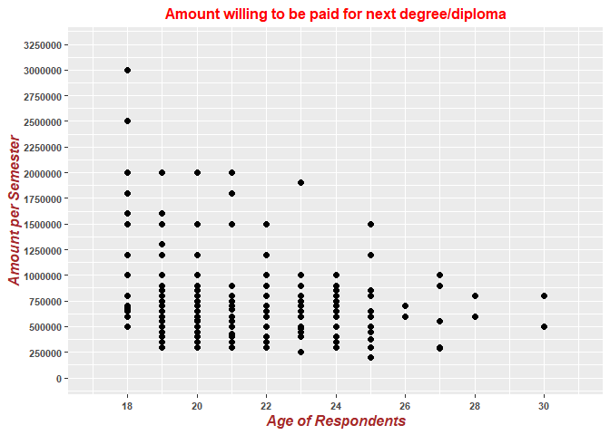
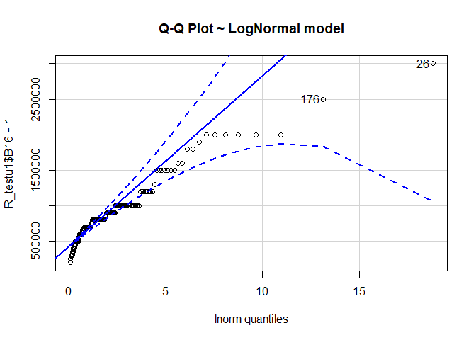
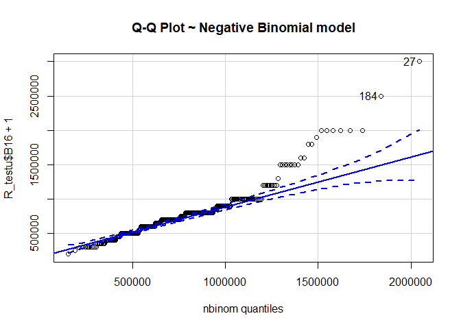
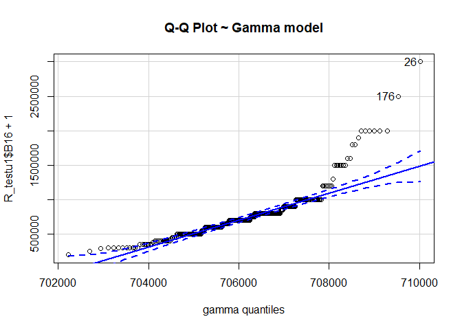
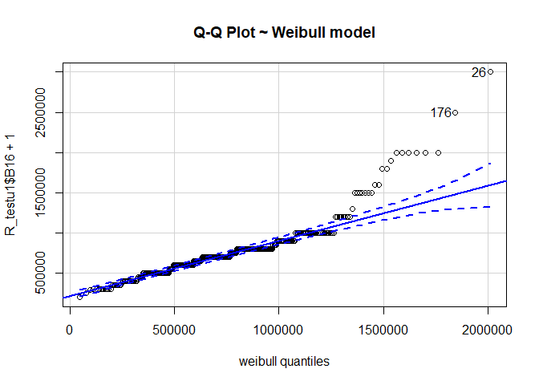

# R Programming

## Set Chunk requirements


```r
knitr::opts_chunk$set(echo = TRUE, message = FALSE, warning = FALSE)
```


## 5. Import data into r


```r
library(tidyverse)
library(lubridate)
## tidyverse includes readr, ggplot2, dplyr, forcats, tibble, tidyr, purrr, stringr
library(stats)
library(readxl)


## Reading our dataset
setwd('F:/Documents/Reinp/GitHub Respositories/DPE_RTest')

R_test <- read_csv("R_test_dataset.csv")
View(R_test)

R_test <- R_test%>%
  mutate(Q_2 = dmy(Q_2))
```


### Structure of the data


### Missing data


```r
#complete.cases(R_test) ##print logical vector indicating complete rows
                       ##(i.e. rows without NA)

#which(!complete.cases(R_test)) #print incomplete cases (rows with NA)

#R_test[complete.cases(R_test), ] ## Keep only the complete rows

#data_complete <- R_test[complete.cases(R_test), ] ## Store the complete cases subset in a new
                                                   ##data frame

#which(is.na(R_test)) #check for missing values

sum(is.na(R_test))
```

```
## [1] 647
```

```r
sapply(R_test,function(x) sum(is.na(x)))
```

```
##       SbjNum   Start_Time          Q_2  Interviewer         Ward           S2 
##            0            0            0            0            0            0 
##           S3           S4         S5_a Social_Class         A1_A         A1_B 
##            0            0            0            0            0            0 
##           A2           A5       Q_25_S           A8           A9          A10 
##            0            0          316            0            0            0 
##          A12       Q_32_S           B3           B4           B8          B16 
##           18          313            0            0            0            0 
##          B17           C1 
##            0            0
```


## 6. Duplicated Cases


```r
#duplicated(R_test$SbjNum)
sum(duplicated(R_test$SbjNum))
```

```
## [1] 4
```

```r
table(duplicated(R_test$SbjNum))
```

```
## 
## FALSE  TRUE 
##   317     4
```

```r
#mean(duplicated(R_test$SbjNum)) #proportion of repeat cases

#sum(duplicated(R_test$SbjNum))/nrow(R_test)
```


## 7. total number of unique interviews 


```r
#unique(R_test$SbjNum)
#count(unique(R_test$SbjNum))
#table(unique(R_test$SbjNum))

## data with unique SbjNum

#R_testu <- R_test[!duplicated(R_test$SbjNum),]


R_testu <- R_test%>%
  filter(SbjNum == unique(SbjNum))


nrow(R_testu)
```

```
## [1] 317
```


## 8. Assigning value labels to variables

```r
R_testu <- R_testu %>%
  mutate(Interviewer = if_else(Interviewer == 1, "Menya Abdmajid",
                        if_else(Interviewer == 2, "Bbale Denis",
                        if_else(Interviewer == 3, "Muwonge Allan Joshua",
                        if_else(Interviewer == 4, "Wambi Ken Paul",        
                        if_else(Interviewer == 5, "Wabwire Thomas", 
                        if_else(Interviewer == 6, "Muhindo Wilfred",
                        if_else(Interviewer == 7, "Ahumuza Owen",
                        if_else(Interviewer == 8, "Mirembe Mary",
                        if_else(Interviewer == 9, "Arinitwe Mackline",        
                        if_else(Interviewer == 10, "Alum Maria",
                        if_else(Interviewer == 11, "Kasule violet",        
                        if_else(Interviewer == 12, "Aweko Monica", "Nabbumba Pennina"       
                                )))))))))))))%>%
  mutate(S2 = if_else(S2 == 1, "17 and below",
                        if_else(S2 == 2, "18-25",
                        if_else(S2 == 3, "26-30", "31 and above" 
                                ))))%>%
  mutate(Social_Class = if_else(Social_Class == 1, "Social Class D",
                        if_else(Social_Class == 2, "Social Class C2",
                        if_else(Social_Class == 3, "Social Class C1", 
                         if_else(Social_Class == 4, "Social Class B", "Social Class A" 
                                )))))%>%
  mutate(B4 = if_else(B4 == 1, "Yes", "No"))%>%
  mutate(B17 = if_else(B17 == 1, "Extremely ready",
                        if_else(B17 == 2, "Somewhat ready",
                        if_else(B17 == 3, "Neutral", 
                         if_else(B17 == 4, "Not ready", "Definitely not ready" 
                                )))))%>%
  mutate(C1 = if_else(C1 == 1, "I have been employed",
              if_else(C1 == 2, "I am self-employed",
              if_else(C1 == 3, " unpaid intern", 
              if_else(C1 == 4, "household activities",
                      "I have not been employed" 
                                )))))
```


## 9. Number of Interviews conducted by each interviewer


```r
library(knitr)
#DollarSign Syntax

kable(table(R_testu$Interviewer))
```


|Var1                 | Freq|
|:--------------------|----:|
|Ahumuza Owen         |   30|
|Alum Maria           |   30|
|Arinitwe Mackline    |   33|
|Kasule violet        |   33|
|Mirembe Mary         |   35|
|Muhindo Wilfred      |   30|
|Muwonge Allan Joshua |   30|
|Nabbumba Pennina     |   31|
|Wabwire Thomas       |   31|
|Wambi Ken Paul       |   34|


## 10. Clean up the ward variable and then compute the number of interviews per ward 


```r
which(is.na(R_testu$Ward)) #check for missing values in ward
```

```
## integer(0)
```

```r
R_testu$Ward <- gsub("Bukoto Nsimbi ziwome", "Bukoto", R_testu$Ward)
R_testu$Ward <- gsub("Bukoto Nsimbi Ziwome", "Bukoto", R_testu$Ward)
R_testu$Ward <- gsub("Bukoto church", "Bukoto", R_testu$Ward)

R_testu$Ward <- gsub("KABOWA", "Kabowa", R_testu$Ward)
R_testu$Ward <- gsub("kabowa", "Kabowa", R_testu$Ward)
R_testu$Ward <- gsub("Kafumbe mukasa", "Kafumbe Mukasa", R_testu$Ward)
R_testu$Ward <- gsub("kagugube", "Kagugube", R_testu$Ward)
R_testu$Ward <- gsub("kamokya", "Kamwokya", R_testu$Ward)
R_testu$Ward <- gsub("KAMWOKYA", "Kamwokya", R_testu$Ward)
R_testu$Ward <- gsub("kansanga", "Kansanga", R_testu$Ward)
R_testu$Ward <- gsub("kasanga", "Kansanga", R_testu$Ward)
R_testu$Ward <- gsub("Kansanga kiwafu Estates", "Kansanga", R_testu$Ward)
R_testu$Ward <- gsub("kanyanya - komamboga zone A", "Kanyanya zone", R_testu$Ward)
R_testu$Ward <- gsub("kanyanya central zone 1", "Kanyanya zone", R_testu$Ward)
R_testu$Ward <- gsub("Kanyanya central zone B", "Kanyanya zone", R_testu$Ward)
R_testu$Ward <- gsub("kasubi", "Kasubi", R_testu$Ward)
R_testu$Ward <- gsub("KASUBI", "Kasubi", R_testu$Ward)
R_testu$Ward <- gsub("kawaala", "Kawaala", R_testu$Ward)
R_testu$Ward <- gsub("Kinawataka zone 1", "Kinawataka", R_testu$Ward)
R_testu$Ward <- gsub("KISASI DUNGU ZONE", "Dungu Zone", R_testu$Ward)
R_testu$Ward <- gsub("kisenyi", "Kisenyi", R_testu$Ward)
R_testu$Ward <- gsub("KISENYI", "Kisenyi", R_testu$Ward)
R_testu$Ward <- gsub("Kisenyi zone 3", "Kisenyi", R_testu$Ward)
R_testu$Ward <- gsub("kisira zone", "Kisira zone", R_testu$Ward)
R_testu$Ward <- gsub("kisugu", "Kisugu", R_testu$Ward)
R_testu$Ward <- gsub("Kisugu Upper Zone", "Kisugu", R_testu$Ward)
R_testu$Ward <- gsub("kiwatule", "Kiwatule", R_testu$Ward)
R_testu$Ward <- gsub("Kiwatule  kinyarwanda", "Kinyarwanda zone", R_testu$Ward)
R_testu$Ward <- gsub("Kiwatule kinyarwanda", "Kinyarwanda zone", R_testu$Ward)

R_testu$Ward <- gsub("lugala", "Lugala", R_testu$Ward)
R_testu$Ward <- gsub("Luwafu kirundu zone", "kiruddu", R_testu$Ward)

R_testu$Ward <- gsub("Makerere  University", "MAKERERE", R_testu$Ward)
R_testu$Ward <- gsub("Makerere Kagugube", "Kagugube", R_testu$Ward)
R_testu$Ward <- gsub("Makerere Kakugube", "Kagugube", R_testu$Ward)
R_testu$Ward <- gsub("makerere kakugube zone", "Kagugube", R_testu$Ward)
R_testu$Ward <- gsub("MAKERERE KAVULE", "Makerere kavule", R_testu$Ward)
R_testu$Ward <- gsub("Makerere kivulu", "Kivulu", R_testu$Ward)
R_testu$Ward <- gsub("Makerere Kivulu", "Kivulu", R_testu$Ward)
R_testu$Ward <- gsub("Mamerere Kagugube", "Kagugube", R_testu$Ward)
R_testu$Ward <- gsub("Makindyd Luwafu", "Makindye", R_testu$Ward)
R_testu$Ward <- gsub("makindye luwafu", "Makindye", R_testu$Ward)
R_testu$Ward <- gsub("Makindye luwafu", "Makindye", R_testu$Ward)
R_testu$Ward <- gsub("Makindye Luwafu", "Makindye", R_testu$Ward)
R_testu$Ward <- gsub("Makindye luwafu kirundu", "kiruddu", R_testu$Ward)
R_testu$Ward <- gsub("Makindye kirundu", "kiruddu", R_testu$Ward)
R_testu$Ward <- gsub("masanafu", "Masanafu", R_testu$Ward)
R_testu$Ward <- gsub("MASANAFU", "Masanafu", R_testu$Ward)
R_testu$Ward <- gsub("MBUYA", "Mbuya", R_testu$Ward)
R_testu$Ward <- gsub("Mbuya 1", "Mbuya", R_testu$Ward)
R_testu$Ward <- gsub("Mbuya kaggo", "Mbuya", R_testu$Ward)
R_testu$Ward <- gsub("Mbuya Kaggo", "Mbuya", R_testu$Ward)
R_testu$Ward <- gsub("Mbuya zone 1", "Mbuya", R_testu$Ward)
R_testu$Ward <- gsub("Mbuya kinawataka", "Kinawataka", R_testu$Ward)
R_testu$Ward <- gsub("Mulago ward C", "Mulago", R_testu$Ward)
R_testu$Ward <- gsub("Mutungo  Some 4", "Mutungo", R_testu$Ward)
R_testu$Ward <- gsub("Mutungo Biina", "Mutungo", R_testu$Ward)
R_testu$Ward <- gsub("Mutungo zone 4", "Mutungo", R_testu$Ward)
R_testu$Ward <- gsub("Mutungo Zone 4", "Mutungo", R_testu$Ward)
R_testu$Ward <- gsub("Mutungu", "Mutungo", R_testu$Ward)
R_testu$Ward <- gsub("Mutungo  Kampala road", "KAMPALA ROAD", R_testu$Ward)
R_testu$Ward <- gsub("Mutungo Kampala road", "KAMPALA ROAD", R_testu$Ward)

R_testu$Ward <- gsub("NABWERU ZONE 1", "Nabweru", R_testu$Ward)
R_testu$Ward <- gsub("nabweru zone1", "Nabweru", R_testu$Ward)
R_testu$Ward <- gsub("NAGURU BARRACKS", "NAGURU", R_testu$Ward)
R_testu$Ward <- gsub("NAKULABYE", "Nakulabye", R_testu$Ward)
R_testu$Ward <- gsub("NALUKABYE", "Nakulabye", R_testu$Ward)
R_testu$Ward <- gsub("NANKULABYE", "Nakulabye", R_testu$Ward)

R_testu$Ward <- gsub("NAMUNGONA", "Namungoona", R_testu$Ward)
R_testu$Ward <- gsub("Namungona Kisugu", "Namungoona", R_testu$Ward)
R_testu$Ward <- gsub("nsambya", "Nsambya", R_testu$Ward)
R_testu$Ward <- gsub("Nsambya  Barracks.", "Nsambya", R_testu$Ward)
R_testu$Ward <- gsub("Nsambya barracks", "Nsambya", R_testu$Ward)
R_testu$Ward <- gsub("Nsambya Barracks", "Nsambya", R_testu$Ward)
R_testu$Ward <- gsub("Nsambya kevina", "Nsambya", R_testu$Ward)
R_testu$Ward <- gsub("Nsambya Kevina", "Nsambya", R_testu$Ward)

R_testu$Ward <- gsub("Sebagala Zone", "Sebaggala zone", R_testu$Ward)
R_testu$Ward <- gsub("wandegeya.junju road", "Wandegeya", R_testu$Ward)
R_testu$Ward <- gsub("WANDEGEYA", "Wandegeya", R_testu$Ward)
R_testu$Ward <- gsub("wankulukuku", "Wankulukuku", R_testu$Ward)
R_testu$Ward <- gsub("WANKULUKUKU", "Wankulukuku", R_testu$Ward)
R_testu$Ward <- gsub("WUNKULUKUKU", "Wankulukuku", R_testu$Ward)

kable(table(R_testu$Ward))
```


|Var1                  | Freq|
|:---------------------|----:|
|Boma zone             |    1|
|Buganda road flats    |    2|
|BUGOLOBI              |    1|
|Bukoto                |    3|
|BUSEGA                |   11|
|BWAISE                |    2|
|Dungu Zone            |    7|
|Kabalagala            |    1|
|Kabowa                |   10|
|Kafumbe Mukasa        |    2|
|Kagugube              |   10|
|Kagwo                 |    1|
|KAMPALA ROAD          |    3|
|Kamwokya              |   11|
|Kansanga              |   12|
|Kanyanya zone         |    3|
|Kasirye zone/mpererwe |    1|
|Kasubi                |   10|
|kasule zone           |    1|
|KATAZA                |    1|
|Kawaala               |    6|
|kazo                  |    2|
|Kiganda zone          |    5|
|Kinawataka            |    5|
|Kinyarwanda zone      |    5|
|KIREKA MIWANDA ZONE   |    1|
|kiruddu               |    3|
|Kisenyi               |    9|
|Kisira zone           |    2|
|Kisugu                |   18|
|KITEBI                |    1|
|Kivulu                |    5|
|Kiwatule              |    7|
|Kizza zone            |    1|
|KYEBANDO              |    9|
|Liganda Zone          |    1|
|Lugala                |    3|
|Lukalubo zone         |    1|
|LUSAZE                |    3|
|Luwafu                |    6|
|MAKERERE              |    8|
|Makerere kavule       |    3|
|Makindye              |    5|
|Masanafu              |   16|
|Mbuya                 |    9|
|Mulago                |    2|
|Mutungo               |   16|
|NABULAGALA            |    3|
|Nabweru               |    2|
|NAGURU                |    5|
|Nakasero              |    1|
|Nakawa                |    4|
|Nakulabye             |    9|
|Namungoona            |    8|
|NATEETE               |    4|
|NDEEBA                |    4|
|Nsambya               |   12|
|Ntinda                |    1|
|Sebaggala zone        |    3|
|Tula zone             |    1|
|Wandegeya             |    7|
|Wankulukuku           |    6|
|Wheeling Zone         |    2|

## 11. interviews were conducted in every ward per interviewer 


```r
kable(table(R_testu$Ward, R_testu$Interviewer))
```


|                      | Ahumuza Owen| Alum Maria| Arinitwe Mackline| Kasule violet| Mirembe Mary| Muhindo Wilfred| Muwonge Allan Joshua| Nabbumba Pennina| Wabwire Thomas| Wambi Ken Paul|
|:---------------------|------------:|----------:|-----------------:|-------------:|------------:|---------------:|--------------------:|----------------:|--------------:|--------------:|
|Boma zone             |            0|          0|                 0|             0|            0|               0|                    0|                0|              1|              0|
|Buganda road flats    |            0|          2|                 0|             0|            0|               0|                    0|                0|              0|              0|
|BUGOLOBI              |            0|          0|                 0|             0|            0|               1|                    0|                0|              0|              0|
|Bukoto                |            0|          0|                 0|             0|            0|               0|                    0|                3|              0|              0|
|BUSEGA                |            0|          0|                 0|            11|            0|               0|                    0|                0|              0|              0|
|BWAISE                |            0|          0|                 0|             0|            2|               0|                    0|                0|              0|              0|
|Dungu Zone            |            0|          6|                 0|             0|            0|               1|                    0|                0|              0|              0|
|Kabalagala            |            0|          0|                 0|             0|            0|               1|                    0|                0|              0|              0|
|Kabowa                |            0|          0|                 0|             5|            5|               0|                    0|                0|              0|              0|
|Kafumbe Mukasa        |            2|          0|                 0|             0|            0|               0|                    0|                0|              0|              0|
|Kagugube              |            2|          2|                 0|             0|            0|               0|                    2|                4|              0|              0|
|Kagwo                 |            1|          0|                 0|             0|            0|               0|                    0|                0|              0|              0|
|KAMPALA ROAD          |            0|          0|                 0|             0|            0|               0|                    2|                0|              1|              0|
|Kamwokya              |            0|          0|                 0|             5|            5|               0|                    0|                1|              0|              0|
|Kansanga              |            2|          0|                 0|             0|            0|               4|                    4|                2|              0|              0|
|Kanyanya zone         |            0|          0|                 0|             0|            0|               0|                    0|                0|              3|              0|
|Kasirye zone/mpererwe |            0|          0|                 0|             0|            0|               0|                    0|                0|              1|              0|
|Kasubi                |            0|          0|                 9|             0|            0|               0|                    0|                0|              0|              1|
|kasule zone           |            0|          0|                 0|             0|            0|               0|                    0|                0|              1|              0|
|KATAZA                |            0|          0|                 0|             0|            0|               1|                    0|                0|              0|              0|
|Kawaala               |            0|          0|                 6|             0|            0|               0|                    0|                0|              0|              0|
|kazo                  |            0|          0|                 0|             0|            0|               0|                    0|                0|              2|              0|
|Kiganda zone          |            0|          0|                 0|             0|            0|               0|                    0|                0|              5|              0|
|Kinawataka            |            3|          2|                 0|             0|            0|               0|                    0|                0|              0|              0|
|Kinyarwanda zone      |            1|          0|                 0|             0|            0|               0|                    0|                4|              0|              0|
|KIREKA MIWANDA ZONE   |            0|          0|                 0|             0|            0|               1|                    0|                0|              0|              0|
|kiruddu               |            0|          0|                 0|             0|            0|               0|                    2|                1|              0|              0|
|Kisenyi               |            0|          0|                 4|             0|            0|               0|                    0|                0|              0|              5|
|Kisira zone           |            0|          0|                 0|             0|            0|               0|                    0|                0|              2|              0|
|Kisugu                |            3|          4|                 0|             0|            0|               3|                    4|                4|              0|              0|
|KITEBI                |            0|          0|                 0|             0|            1|               0|                    0|                0|              0|              0|
|Kivulu                |            0|          0|                 0|             0|            0|               4|                    0|                0|              1|              0|
|Kiwatule              |            3|          0|                 0|             0|            0|               0|                    4|                0|              0|              0|
|Kizza zone            |            0|          0|                 0|             0|            0|               0|                    0|                0|              1|              0|
|KYEBANDO              |            0|          0|                 0|             5|            4|               0|                    0|                0|              0|              0|
|Liganda Zone          |            0|          0|                 0|             0|            0|               0|                    0|                0|              1|              0|
|Lugala                |            0|          0|                 3|             0|            0|               0|                    0|                0|              0|              0|
|Lukalubo zone         |            0|          0|                 0|             0|            0|               0|                    0|                0|              1|              0|
|LUSAZE                |            0|          0|                 0|             0|            0|               0|                    0|                0|              0|              3|
|Luwafu                |            4|          0|                 1|             0|            0|               0|                    1|                0|              0|              0|
|MAKERERE              |            0|          0|                 0|             0|            7|               0|                    1|                0|              0|              0|
|Makerere kavule       |            0|          0|                 0|             0|            0|               0|                    0|                0|              3|              0|
|Makindye              |            0|          3|                 0|             0|            0|               0|                    0|                2|              0|              0|
|Masanafu              |            0|          0|                 6|             0|            0|               0|                    0|                0|              0|             10|
|Mbuya                 |            1|          2|                 0|             0|            0|               1|                    5|                0|              0|              0|
|Mulago                |            0|          0|                 0|             0|            0|               0|                    0|                0|              2|              0|
|Mutungo               |            5|          5|                 0|             0|            0|               3|                    3|                0|              0|              0|
|NABULAGALA            |            0|          0|                 0|             0|            0|               0|                    0|                0|              0|              3|
|Nabweru               |            0|          0|                 0|             0|            0|               0|                    0|                0|              2|              0|
|NAGURU                |            0|          0|                 0|             0|            0|               5|                    0|                0|              0|              0|
|Nakasero              |            0|          1|                 0|             0|            0|               0|                    0|                0|              0|              0|
|Nakawa                |            0|          0|                 0|             0|            0|               0|                    0|                4|              0|              0|
|Nakulabye             |            0|          0|                 2|             0|            4|               0|                    0|                0|              0|              3|
|Namungoona            |            0|          0|                 2|             0|            0|               1|                    0|                0|              0|              5|
|NATEETE               |            0|          0|                 0|             4|            0|               0|                    0|                0|              0|              0|
|NDEEBA                |            0|          0|                 0|             0|            0|               0|                    0|                0|              0|              4|
|Nsambya               |            3|          0|                 0|             0|            0|               3|                    0|                6|              0|              0|
|Ntinda                |            0|          0|                 0|             0|            0|               1|                    0|                0|              0|              0|
|Sebaggala zone        |            0|          0|                 0|             0|            0|               0|                    0|                0|              3|              0|
|Tula zone             |            0|          0|                 0|             0|            0|               0|                    0|                0|              1|              0|
|Wandegeya             |            0|          1|                 0|             0|            4|               0|                    2|                0|              0|              0|
|Wankulukuku           |            0|          0|                 0|             3|            3|               0|                    0|                0|              0|              0|
|Wheeling Zone         |            0|          2|                 0|             0|            0|               0|                    0|                0|              0|              0|

```r
kable(table(R_testu$Interviewer, R_testu$Ward))
```


|                     | Boma zone| Buganda road flats| BUGOLOBI| Bukoto| BUSEGA| BWAISE| Dungu Zone| Kabalagala| Kabowa| Kafumbe Mukasa| Kagugube| Kagwo| KAMPALA ROAD| Kamwokya| Kansanga| Kanyanya zone| Kasirye zone/mpererwe| Kasubi| kasule zone| KATAZA| Kawaala| kazo| Kiganda zone| Kinawataka| Kinyarwanda zone| KIREKA MIWANDA ZONE| kiruddu| Kisenyi| Kisira zone| Kisugu| KITEBI| Kivulu| Kiwatule| Kizza zone| KYEBANDO| Liganda Zone| Lugala| Lukalubo zone| LUSAZE| Luwafu| MAKERERE| Makerere kavule| Makindye| Masanafu| Mbuya| Mulago| Mutungo| NABULAGALA| Nabweru| NAGURU| Nakasero| Nakawa| Nakulabye| Namungoona| NATEETE| NDEEBA| Nsambya| Ntinda| Sebaggala zone| Tula zone| Wandegeya| Wankulukuku| Wheeling Zone|
|:--------------------|---------:|------------------:|--------:|------:|------:|------:|----------:|----------:|------:|--------------:|--------:|-----:|------------:|--------:|--------:|-------------:|---------------------:|------:|-----------:|------:|-------:|----:|------------:|----------:|----------------:|-------------------:|-------:|-------:|-----------:|------:|------:|------:|--------:|----------:|--------:|------------:|------:|-------------:|------:|------:|--------:|---------------:|--------:|--------:|-----:|------:|-------:|----------:|-------:|------:|--------:|------:|---------:|----------:|-------:|------:|-------:|------:|--------------:|---------:|---------:|-----------:|-------------:|
|Ahumuza Owen         |         0|                  0|        0|      0|      0|      0|          0|          0|      0|              2|        2|     1|            0|        0|        2|             0|                     0|      0|           0|      0|       0|    0|            0|          3|                1|                   0|       0|       0|           0|      3|      0|      0|        3|          0|        0|            0|      0|             0|      0|      4|        0|               0|        0|        0|     1|      0|       5|          0|       0|      0|        0|      0|         0|          0|       0|      0|       3|      0|              0|         0|         0|           0|             0|
|Alum Maria           |         0|                  2|        0|      0|      0|      0|          6|          0|      0|              0|        2|     0|            0|        0|        0|             0|                     0|      0|           0|      0|       0|    0|            0|          2|                0|                   0|       0|       0|           0|      4|      0|      0|        0|          0|        0|            0|      0|             0|      0|      0|        0|               0|        3|        0|     2|      0|       5|          0|       0|      0|        1|      0|         0|          0|       0|      0|       0|      0|              0|         0|         1|           0|             2|
|Arinitwe Mackline    |         0|                  0|        0|      0|      0|      0|          0|          0|      0|              0|        0|     0|            0|        0|        0|             0|                     0|      9|           0|      0|       6|    0|            0|          0|                0|                   0|       0|       4|           0|      0|      0|      0|        0|          0|        0|            0|      3|             0|      0|      1|        0|               0|        0|        6|     0|      0|       0|          0|       0|      0|        0|      0|         2|          2|       0|      0|       0|      0|              0|         0|         0|           0|             0|
|Kasule violet        |         0|                  0|        0|      0|     11|      0|          0|          0|      5|              0|        0|     0|            0|        5|        0|             0|                     0|      0|           0|      0|       0|    0|            0|          0|                0|                   0|       0|       0|           0|      0|      0|      0|        0|          0|        5|            0|      0|             0|      0|      0|        0|               0|        0|        0|     0|      0|       0|          0|       0|      0|        0|      0|         0|          0|       4|      0|       0|      0|              0|         0|         0|           3|             0|
|Mirembe Mary         |         0|                  0|        0|      0|      0|      2|          0|          0|      5|              0|        0|     0|            0|        5|        0|             0|                     0|      0|           0|      0|       0|    0|            0|          0|                0|                   0|       0|       0|           0|      0|      1|      0|        0|          0|        4|            0|      0|             0|      0|      0|        7|               0|        0|        0|     0|      0|       0|          0|       0|      0|        0|      0|         4|          0|       0|      0|       0|      0|              0|         0|         4|           3|             0|
|Muhindo Wilfred      |         0|                  0|        1|      0|      0|      0|          1|          1|      0|              0|        0|     0|            0|        0|        4|             0|                     0|      0|           0|      1|       0|    0|            0|          0|                0|                   1|       0|       0|           0|      3|      0|      4|        0|          0|        0|            0|      0|             0|      0|      0|        0|               0|        0|        0|     1|      0|       3|          0|       0|      5|        0|      0|         0|          1|       0|      0|       3|      1|              0|         0|         0|           0|             0|
|Muwonge Allan Joshua |         0|                  0|        0|      0|      0|      0|          0|          0|      0|              0|        2|     0|            2|        0|        4|             0|                     0|      0|           0|      0|       0|    0|            0|          0|                0|                   0|       2|       0|           0|      4|      0|      0|        4|          0|        0|            0|      0|             0|      0|      1|        1|               0|        0|        0|     5|      0|       3|          0|       0|      0|        0|      0|         0|          0|       0|      0|       0|      0|              0|         0|         2|           0|             0|
|Nabbumba Pennina     |         0|                  0|        0|      3|      0|      0|          0|          0|      0|              0|        4|     0|            0|        1|        2|             0|                     0|      0|           0|      0|       0|    0|            0|          0|                4|                   0|       1|       0|           0|      4|      0|      0|        0|          0|        0|            0|      0|             0|      0|      0|        0|               0|        2|        0|     0|      0|       0|          0|       0|      0|        0|      4|         0|          0|       0|      0|       6|      0|              0|         0|         0|           0|             0|
|Wabwire Thomas       |         1|                  0|        0|      0|      0|      0|          0|          0|      0|              0|        0|     0|            1|        0|        0|             3|                     1|      0|           1|      0|       0|    2|            5|          0|                0|                   0|       0|       0|           2|      0|      0|      1|        0|          1|        0|            1|      0|             1|      0|      0|        0|               3|        0|        0|     0|      2|       0|          0|       2|      0|        0|      0|         0|          0|       0|      0|       0|      0|              3|         1|         0|           0|             0|
|Wambi Ken Paul       |         0|                  0|        0|      0|      0|      0|          0|          0|      0|              0|        0|     0|            0|        0|        0|             0|                     0|      1|           0|      0|       0|    0|            0|          0|                0|                   0|       0|       5|           0|      0|      0|      0|        0|          0|        0|            0|      0|             0|      3|      0|        0|               0|        0|       10|     0|      0|       0|          3|       0|      0|        0|      0|         3|          5|       0|      4|       0|      0|              0|         0|         0|           0|             0|


## 12.	Would you say older people are in high Social class?


```r
kable(table(R_testu$Social_Class, R_testu$A2))
```


|                | 18| 19| 20| 21| 22| 23| 24| 25| 26| 27| 28| 30|
|:---------------|--:|--:|--:|--:|--:|--:|--:|--:|--:|--:|--:|--:|
|Social Class B  |  7| 26| 27| 10|  9|  9| 12|  6|  2|  1|  0|  1|
|Social Class C1 | 11| 34| 24| 13|  5|  8|  6|  4|  2|  2|  1|  0|
|Social Class C2 |  8| 25| 19|  9|  9| 10|  7|  6|  0|  2|  1|  1|

```r
kable(table(R_testu$A2, R_testu$Social_Class))
```


|   | Social Class B| Social Class C1| Social Class C2|
|:--|--------------:|---------------:|---------------:|
|18 |              7|              11|               8|
|19 |             26|              34|              25|
|20 |             27|              24|              19|
|21 |             10|              13|               9|
|22 |              9|               5|               9|
|23 |              9|               8|              10|
|24 |             12|               6|               7|
|25 |              6|               4|               6|
|26 |              2|               2|               0|
|27 |              1|               2|               2|
|28 |              0|               1|               1|
|30 |              1|               0|               1|

```r
kable(table(R_testu$Social_Class, R_testu$S2))
```


|                | 18-25| 26-30|
|:---------------|-----:|-----:|
|Social Class B  |   106|     4|
|Social Class C1 |   105|     5|
|Social Class C2 |    93|     4|

```r
kable(table(R_testu$S2, R_testu$Social_Class))
```


|      | Social Class B| Social Class C1| Social Class C2|
|:-----|--------------:|---------------:|---------------:|
|18-25 |            106|             105|              93|
|26-30 |              4|               5|               4|


## 13.	What is the minimum, maximum, average and median age of the respondents 


```r
library(mosaic)
#favstats(~A2, data=R_testu)
kable(favstats(~A2, data=R_testu)[c("min", "max", "mean","median")])
```


|   | min| max|     mean| median|
|:--|---:|---:|--------:|------:|
|   |  18|  30| 20.93691|     20|

```r
#favstats(~B16, data=R_testu)
kable(favstats(~B16, data=R_testu)[c("min", "max", "mean","median")])
```


|   |   min|   max|     mean| median|
|:--|-----:|-----:|--------:|------:|
|   | 2e+05| 3e+06| 769526.8|  7e+05|

## 14.	Plot A2 against B16. Add title and axes labels 

### ggplot- lineplot


```r
ggplot(R_testu%>%group_by(A2) %>%summarise(B16 = mean(B16)), aes(A2, B16))+
  labs(title="Avearage amount willing to be paid for next degree/diploma", 
       x="Age of Respondents", y="Amount per Semester") +
  theme(axis.title=element_text(face="bold.italic", size="12", color="brown"), 
        axis.text = element_text(size = 8, face="bold"), 
        plot.title=element_text(size=12, face="bold", color="red", hjust = 0.5))+
  geom_point(size=2)+
  geom_line(colour="blue", size=1)+
  #geom_text(aes(label=R_testuplot$A2), nudge_x = 0.2, size=3)+
  scale_x_continuous(breaks = c(16, 18, 20, 22, 24, 26, 28, 30, 32), limits=c(17,31))+
  scale_y_continuous(breaks = c(0, 200000, 400000, 600000, 800000, 1000000, 1200000), 
                     limits=c(0,1200000))
```

<!-- -->

```r
#If the plot is on the screen ggsave(“path/filename.png”)

#If you have a plot object ggsave(myplot, file=“path/filename.png”)

#Specify size ggsave(myplot, “path/filename.png”, width=6, height=4)

# any plot format (pdf, png, eps, svg, jpg)
```

### ggplot Scatterplot


```r
ggplot(R_testu, aes(A2, B16))+
  labs(title="Amount willing to be paid for next degree/diploma", 
       x="Age of Respondents", y="Amount per Semester") +
  theme(axis.title=element_text(face="bold.italic", size="12", color="brown"), 
        axis.text = element_text(size = 8, face="bold"), 
        plot.title=element_text(size=12, face="bold", color="red", hjust = 0.5))+
  geom_point(size=2)+
  scale_x_continuous(breaks = c(16, 18, 20, 22, 24, 26, 28, 30, 32), limits=c(17,31))+
  scale_y_continuous(breaks = c(0, 250000, 500000, 750000, 1000000, 1250000, 1500000, 
                  1750000, 2000000, 2250000, 2500000, 2750000, 3000000, 3250000),
                  limits=c(0,3250000))
```

<!-- -->

## 15.	What is the proportion of girls who are in non-girls only schools 


```r
#Was your school an all secondary girls school?
table(R_testu$B4)
```

```
## 
##  No Yes 
## 282  35
```

```r
prop.table(table(R_testu$B4))
```

```
## 
##        No       Yes 
## 0.8895899 0.1104101
```

## 16. dataset of the respondents who are aged between 18 – 25 years only 


```r
R_testu18_25 <- subset(R_testu, S2 == "18-25")

#write_excel_csv(R_testu18_25, "R_testu18_25.csv")
```


## 17.	Conduct any additional analysis in the data 

### Distribution of B16 Variable


```r
nrow(R_test)
```

```
## [1] 321
```

```r
nrow(R_testu)
```

```
## [1] 317
```

```r
R_testu1 = subset(R_testu, select = -c(Q_25_S,Q_32_S) ) #Delete column by name

R_testu1 <- na.omit(R_testu1) # Getting rid of missing data

nrow(R_testu1)
```

```
## [1] 299
```

```r
which(is.na(R_testu1)) #check for missing values
```

```
## integer(0)
```

```r
sum(is.na(R_testu1))
```

```
## [1] 0
```

```r
library(car)
library(MASS) #So that distributions that must be non-zero can make sense of my data


qqp(R_testu1$B16+1, "norm", main="Q-Q Plot ~ Normal model")
```

<!-- -->

```
## [1]  26 176
```

```r
qqp(R_testu1$B16+1, "lnorm", main="Q-Q Plot ~ LogNormal model") #lnorm is lognormal
```

<!-- -->

```
## [1]  26 176
```

```r
qqp(R_testu1$B16+1, "exp", main="Q-Q Plot ~ Exponential model")
```

<!-- -->

```
## [1]  26 176
```

```r
#qqp requires estimates of the parameters of the negative binomial, Poisson
# and gamma distributions. You can generate estimates using the fitdistr function.
#negative binomial and gamma distributions can only handle positive numbers.
#Poisson distribution can only handle positive whole numbers.
#Binomial and Poisson distributions are different from the others because they are
#discrete rather than continuous, which means they quantify distinct,
#countable events or the probability of these events

nbinom <- fitdistr(R_testu$B16+1, "Negative Binomial")
qqp(R_testu$B16+1, "nbinom", size = nbinom$estimate[[1]], mu =
nbinom$estimate[[2]], main="Q-Q Plot ~ Negative Binomial model")
```

<!-- -->

```
## [1]  27 184
```

```r
pois <- fitdistr(R_testu1$B16+1, "Poisson")
qqp(R_testu1$B16+1, "pois", lambda=pois$estimate, main="Q-Q Plot ~ Poisson model")
```

<!-- -->

```
## [1]  26 176
```

```r
gamma <- fitdistr(R_testu1$B16+1, "gamma",
list(shape = 1, rate = 0.1), lower = 0.4)
qqp(R_testu1$B16+1, "gamma", shape = gamma$estimate[[1]], rate =
gamma$estimate[[2]], main="Q-Q Plot ~ Gamma model")
```

<!-- -->

```
## [1]  26 176
```

```r
weibull <- fitdistr(R_testu1$B16+1, "weibull")
qqp(R_testu1$B16+1, "weibull", shape = weibull$estimate[[1]],
scale=weibull$estimate[[2]], main="Q-Q Plot ~ Weibull model")
```

<!-- -->

```
## [1]  26 176
```


### Multiple Regression


```r
#convert categorical variables to integer data types for regression purpose

R_testu_reg <- R_testu%>%
  mutate(S3 = if_else(S3 == 1, "None/did not complete",
              if_else(S3 == 2, "(UCE) 1-2 passes",
              if_else(S3 == 3, "(UCE) 3-5 passes",
              if_else(S3 == 4, "(UCE) 5 or more passes",        
              if_else(S3 == 5, "(UACE) – 1 principal", 
              if_else(S3 == 6, "(UACE) 2 principal", 
                    "(UACE) 3 principals")))))))%>%
  mutate(S4 = if_else(S4 == 1, "Yes", "No"))%>%
  mutate(S5_a = if_else(S5_a == 1, "Yes",
                        if_else(S5_a == 2, "No", "I don't know")))%>%
  mutate(A5 = if_else(A5 == 1, "Central",
              if_else(A5 == 2, "Western",
              if_else(A5 == 3, "Eastern",
              if_else(A5 == 4, "Northern", "Other")))))%>%
  mutate(A8 = if_else(A8 == 1, "Single",
              if_else(A8 == 2, "Married",
              if_else(A8 == 3, "Divorced or Separated", "Widowed"))))%>%
  mutate(A9 = if_else(A9 == 1, "I do not have children",
              if_else(A9 == 2, "I have 1 child",
              if_else(A9 == 3, "I have 2 children",
              if_else(A9 == 4, "I have 3 children", "I have more than 3 children")))))%>%
  mutate(A10 = if_else(A10 == 1, "I live alone",
              if_else(A10 == 2, "I live with one other person",
              if_else(A10 == 3, "I live with 2-3 other people",
              if_else(A10 == 4, "I live with 4-6 other people",
                      "I live with 7 or more people")))))%>%
  mutate(A12 = if_else(A12 == 1, "I am the head",
              if_else(A12 == 2, "I am the wife",
              if_else(A12 == 3, "I am the daughter",
              if_else(A12 == 4, "I am a relative",        
              if_else(A12 == 5, "I am a friend", 
              "Other"))))))%>%
  mutate(B8 = if_else(B8 == 1, "Diploma",
                        if_else(B8 == 2, "Technical certificate", "Bachelor's degree")))%>%
  mutate(S2 = factor(S2))%>%
  mutate(S3 = factor(S3))%>%
  mutate(S4 = factor(S4))%>%
  mutate(Social_Class = factor(Social_Class))%>%
  mutate(A5 = factor(A5))%>%
  mutate(A8 = factor(A8))%>%
  mutate(A9 = factor(A9))%>%
  mutate(A10 = factor(A10))%>%
  mutate(A12 = factor(A12))%>%
  mutate(B4 = factor(B4))%>%
  mutate(B8 = factor(B8))%>%
  mutate(B17 = factor(B17))%>%
  mutate(C1 = factor(C1))%>%
  dplyr:: rename(age_grouped = "S2",
                 secondary_school_certificate = "S3",
                 enrolled_tertiary_school_certificate = "S4",
                 age = "A2",
                 region_of_origin = "A5",
                 marital_status = "A8",
                 No_of_children = "A9",
                 No_people_living_with = "A10",
                 relationship_to_head_of_household = "A12",
                 all_secondary_girls_school = "B4",
                 career_next_level_of_education = "B8",
                 willing_to_pay_next_level_of_education = "B16",
                 career_ready = "B17",
                 employed_last_12months = "C1")%>%
dplyr:: select(7,10,13,14, 16,17, 18, 19, 22, 23, 24, 25, 26)%>%
  drop_na()

select
```

```
## function (obj) 
## UseMethod("select")
## <bytecode: 0x0000000024b90aa0>
## <environment: namespace:MASS>
```

```r
str(R_testu_reg)
```

```
## tibble [299 x 13] (S3: tbl_df/tbl/data.frame)
##  $ secondary_school_certificate          : Factor w/ 5 levels "(UACE) – 1 principal",..: 4 5 4 3 3 3 5 5 5 3 ...
##  $ Social_Class                          : Factor w/ 3 levels "Social Class B",..: 2 3 2 1 1 3 3 1 3 1 ...
##  $ age                                   : num [1:299] 20 21 20 19 19 21 19 19 19 19 ...
##  $ region_of_origin                      : Factor w/ 5 levels "Central","Eastern",..: 5 2 1 1 1 1 1 5 1 5 ...
##  $ marital_status                        : Factor w/ 3 levels "Divorced or Separated",..: 3 3 3 3 3 3 3 3 3 3 ...
##  $ No_of_children                        : Factor w/ 4 levels "I do not have children",..: 1 1 1 1 1 2 1 1 1 1 ...
##  $ No_people_living_with                 : Factor w/ 5 levels "I live alone",..: 4 5 4 4 4 4 3 4 4 5 ...
##  $ relationship_to_head_of_household     : Factor w/ 6 levels "I am a friend",..: 3 4 2 3 3 3 3 3 3 2 ...
##  $ all_secondary_girls_school            : Factor w/ 2 levels "No","Yes": 1 1 1 1 2 1 1 1 1 2 ...
##  $ career_next_level_of_education        : Factor w/ 3 levels "Bachelor's degree",..: 1 2 3 1 1 1 1 1 1 1 ...
##  $ willing_to_pay_next_level_of_education: num [1:299] 1000000 800000 500000 800000 1500000 800000 900000 700000 1500000 700000 ...
##  $ career_ready                          : Factor w/ 5 levels "Definitely not ready",..: 4 5 5 1 5 5 4 4 5 1 ...
##  $ employed_last_12months                : Factor w/ 5 levels " unpaid intern",..: 5 5 5 3 4 5 5 5 5 5 ...
```


```r
mlm1a <- lm(willing_to_pay_next_level_of_education ~ .,
data=R_testu_reg) #multiple regression
summary(mlm1a)
```

```
## 
## Call:
## lm(formula = willing_to_pay_next_level_of_education ~ ., data = R_testu_reg)
## 
## Residuals:
##     Min      1Q  Median      3Q     Max 
## -600372 -162013  -45409   87087 1740278 
## 
## Coefficients:
##                                                     Estimate Std. Error t value
## (Intercept)                                          1239190     596526   2.077
## secondary_school_certificate(UACE) 2 principal        240555     216046   1.113
## secondary_school_certificate(UACE) 3 principals        40159     211793   0.190
## secondary_school_certificate(UCE) 3-5 passes          109267     212310   0.515
## secondary_school_certificate(UCE) 5 or more passes    133407     213682   0.624
## Social_ClassSocial Class C1                            -9098      48366  -0.188
## Social_ClassSocial Class C2                          -135689      50193  -2.703
## age                                                   -19917      11623  -1.714
## region_of_originEastern                               -36605      60477  -0.605
## region_of_originNorthern                               24845      71064   0.350
## region_of_originOther                                -108326     159231  -0.680
## region_of_originWestern                               -51025      51000  -1.000
## marital_statusMarried                                 186356     418481   0.445
## marital_statusSingle                                   62038     371936   0.167
## No_of_childrenI have 1 child                          -41795      99982  -0.418
## No_of_childrenI have 2 children                        66792     161770   0.413
## No_of_childrenI have 3 children                        17029     270902   0.063
## No_people_living_withI live with 4-6 other people      41762      57492   0.726
## No_people_living_withI live with 7 or more people     -44754      63359  -0.706
## No_people_living_withI live with one other person     -35034      77475  -0.452
## relationship_to_head_of_householdI am a relative       25556     246913   0.104
## relationship_to_head_of_householdI am the daughter     89912     245955   0.366
## relationship_to_head_of_householdI am the head        203649     268881   0.757
## relationship_to_head_of_householdI am the wife        -30776     326533  -0.094
## relationship_to_head_of_householdOther                187242     272581   0.687
## all_secondary_girls_schoolYes                          -5332      67219  -0.079
## career_next_level_of_educationDiploma                -249835      48514  -5.150
## career_next_level_of_educationTechnical certificate  -435942     138471  -3.148
## career_readyExtremely ready                            54423     139763   0.389
## career_readyNeutral                                   205194      88982   2.306
## career_readyNot ready                                 -15402      53157  -0.290
## career_readySomewhat ready                             40609      54455   0.746
## employed_last_12monthshousehold activities           -193926     195519  -0.992
## employed_last_12monthsI am self-employed              -84295     176627  -0.477
## employed_last_12monthsI have been employed           -230731     162634  -1.419
## employed_last_12monthsI have not been employed        -95842     157983  -0.607
##                                                     Pr(>|t|)    
## (Intercept)                                          0.03874 *  
## secondary_school_certificate(UACE) 2 principal       0.26653    
## secondary_school_certificate(UACE) 3 principals      0.84976    
## secondary_school_certificate(UCE) 3-5 passes         0.60722    
## secondary_school_certificate(UCE) 5 or more passes   0.53296    
## Social_ClassSocial Class C1                          0.85093    
## Social_ClassSocial Class C2                          0.00731 ** 
## age                                                  0.08778 .  
## region_of_originEastern                              0.54553    
## region_of_originNorthern                             0.72691    
## region_of_originOther                                0.49691    
## region_of_originWestern                              0.31799    
## marital_statusMarried                                0.65646    
## marital_statusSingle                                 0.86766    
## No_of_childrenI have 1 child                         0.67627    
## No_of_childrenI have 2 children                      0.68003    
## No_of_childrenI have 3 children                      0.94993    
## No_people_living_withI live with 4-6 other people    0.46824    
## No_people_living_withI live with 7 or more people    0.48060    
## No_people_living_withI live with one other person    0.65150    
## relationship_to_head_of_householdI am a relative     0.91764    
## relationship_to_head_of_householdI am the daughter   0.71498    
## relationship_to_head_of_householdI am the head       0.44949    
## relationship_to_head_of_householdI am the wife       0.92498    
## relationship_to_head_of_householdOther               0.49274    
## all_secondary_girls_schoolYes                        0.93683    
## career_next_level_of_educationDiploma               5.12e-07 ***
## career_next_level_of_educationTechnical certificate  0.00183 ** 
## career_readyExtremely ready                          0.69730    
## career_readyNeutral                                  0.02189 *  
## career_readyNot ready                                0.77224    
## career_readySomewhat ready                           0.45649    
## employed_last_12monthshousehold activities           0.32218    
## employed_last_12monthsI am self-employed             0.63358    
## employed_last_12monthsI have been employed           0.15717    
## employed_last_12monthsI have not been employed       0.54460    
## ---
## Signif. codes:  0 '***' 0.001 '**' 0.01 '*' 0.05 '.' 0.1 ' ' 1
## 
## Residual standard error: 327200 on 263 degrees of freedom
## Multiple R-squared:  0.2914,	Adjusted R-squared:  0.1971 
## F-statistic: 3.091 on 35 and 263 DF,  p-value: 1.345e-07
```


```r
# stepwise regression

library(MASS)
summary(stepAIC(mlm1a))
```

```
## Start:  AIC=7627.23
## willing_to_pay_next_level_of_education ~ secondary_school_certificate + 
##     Social_Class + age + region_of_origin + marital_status + 
##     No_of_children + No_people_living_with + relationship_to_head_of_household + 
##     all_secondary_girls_school + career_next_level_of_education + 
##     career_ready + employed_last_12months
## 
##                                     Df  Sum of Sq        RSS    AIC
## - region_of_origin                   4 2.0509e+11 2.8361e+13 7621.4
## - No_of_children                     3 6.5138e+10 2.8221e+13 7621.9
## - relationship_to_head_of_household  5 4.9477e+11 2.8651e+13 7622.4
## - marital_status                     2 4.0279e+10 2.8196e+13 7623.7
## - No_people_living_with              3 3.5103e+11 2.8507e+13 7624.9
## - all_secondary_girls_school         1 6.7371e+08 2.8157e+13 7625.2
## - career_ready                       4 7.3119e+11 2.8887e+13 7626.9
## <none>                                            2.8156e+13 7627.2
## - age                                1 3.1437e+11 2.8470e+13 7628.6
## - secondary_school_certificate       4 9.8749e+11 2.9143e+13 7629.5
## - employed_last_12months             4 9.8955e+11 2.9146e+13 7629.6
## - Social_Class                       2 9.6766e+11 2.9124e+13 7633.3
## - career_next_level_of_education     2 3.1327e+12 3.1289e+13 7654.8
## 
## Step:  AIC=7621.4
## willing_to_pay_next_level_of_education ~ secondary_school_certificate + 
##     Social_Class + age + marital_status + No_of_children + No_people_living_with + 
##     relationship_to_head_of_household + all_secondary_girls_school + 
##     career_next_level_of_education + career_ready + employed_last_12months
## 
##                                     Df  Sum of Sq        RSS    AIC
## - No_of_children                     3 5.8393e+10 2.8419e+13 7616.0
## - relationship_to_head_of_household  5 4.9795e+11 2.8859e+13 7616.6
## - marital_status                     2 4.5380e+10 2.8406e+13 7617.9
## - No_people_living_with              3 3.1592e+11 2.8677e+13 7618.7
## - all_secondary_girls_school         1 4.2426e+09 2.8365e+13 7619.4
## - career_ready                       4 6.7922e+11 2.9040e+13 7620.5
## <none>                                            2.8361e+13 7621.4
## - employed_last_12months             4 9.4442e+11 2.9305e+13 7623.2
## - age                                1 3.7196e+11 2.8733e+13 7623.3
## - secondary_school_certificate       4 1.0856e+12 2.9447e+13 7624.6
## - Social_Class                       2 9.3867e+11 2.9300e+13 7627.1
## - career_next_level_of_education     2 3.2926e+12 3.1654e+13 7650.2
## 
## Step:  AIC=7616.02
## willing_to_pay_next_level_of_education ~ secondary_school_certificate + 
##     Social_Class + age + marital_status + No_people_living_with + 
##     relationship_to_head_of_household + all_secondary_girls_school + 
##     career_next_level_of_education + career_ready + employed_last_12months
## 
##                                     Df  Sum of Sq        RSS    AIC
## - relationship_to_head_of_household  5 5.0512e+11 2.8925e+13 7611.3
## - marital_status                     2 3.2739e+10 2.8452e+13 7612.4
## - No_people_living_with              3 3.1442e+11 2.8734e+13 7613.3
## - all_secondary_girls_school         1 8.7767e+09 2.8428e+13 7614.1
## - career_ready                       4 6.5988e+11 2.9079e+13 7614.9
## <none>                                            2.8419e+13 7616.0
## - employed_last_12months             4 9.1597e+11 2.9335e+13 7617.5
## - age                                1 3.9677e+11 2.8816e+13 7618.2
## - secondary_school_certificate       4 1.1071e+12 2.9527e+13 7619.4
## - Social_Class                       2 9.2612e+11 2.9346e+13 7621.6
## - career_next_level_of_education     2 3.2686e+12 3.1688e+13 7644.6
## 
## Step:  AIC=7611.29
## willing_to_pay_next_level_of_education ~ secondary_school_certificate + 
##     Social_Class + age + marital_status + No_people_living_with + 
##     all_secondary_girls_school + career_next_level_of_education + 
##     career_ready + employed_last_12months
## 
##                                  Df  Sum of Sq        RSS    AIC
## - marital_status                  2 1.1016e+10 2.8936e+13 7607.4
## - all_secondary_girls_school      1 1.3119e+10 2.8938e+13 7609.4
## - career_ready                    4 6.0952e+11 2.9534e+13 7609.5
## - No_people_living_with           3 4.1683e+11 2.9341e+13 7609.6
## <none>                                         2.8925e+13 7611.3
## - age                             1 2.6847e+11 2.9193e+13 7612.0
## - employed_last_12months          4 8.8227e+11 2.9807e+13 7612.3
## - secondary_school_certificate    4 1.0156e+12 2.9940e+13 7613.6
## - Social_Class                    2 9.9240e+11 2.9917e+13 7617.4
## - career_next_level_of_education  2 3.3318e+12 3.2256e+13 7639.9
## 
## Step:  AIC=7607.4
## willing_to_pay_next_level_of_education ~ secondary_school_certificate + 
##     Social_Class + age + No_people_living_with + all_secondary_girls_school + 
##     career_next_level_of_education + career_ready + employed_last_12months
## 
##                                  Df  Sum of Sq        RSS    AIC
## - all_secondary_girls_school      1 1.2444e+10 2.8948e+13 7605.5
## - career_ready                    4 6.1699e+11 2.9553e+13 7605.7
## - No_people_living_with           3 4.2641e+11 2.9362e+13 7605.8
## <none>                                         2.8936e+13 7607.4
## - age                             1 2.7564e+11 2.9211e+13 7608.2
## - employed_last_12months          4 8.7332e+11 2.9809e+13 7608.3
## - secondary_school_certificate    4 1.0194e+12 2.9955e+13 7609.8
## - Social_Class                    2 9.9181e+11 2.9927e+13 7613.5
## - career_next_level_of_education  2 3.4855e+12 3.2421e+13 7637.4
## 
## Step:  AIC=7605.53
## willing_to_pay_next_level_of_education ~ secondary_school_certificate + 
##     Social_Class + age + No_people_living_with + career_next_level_of_education + 
##     career_ready + employed_last_12months
## 
##                                  Df  Sum of Sq        RSS    AIC
## - No_people_living_with           3 4.4431e+11 2.9392e+13 7604.1
## - career_ready                    4 6.5536e+11 2.9603e+13 7604.2
## <none>                                         2.8948e+13 7605.5
## - age                             1 2.7509e+11 2.9223e+13 7606.4
## - employed_last_12months          4 9.1711e+11 2.9865e+13 7606.9
## - secondary_school_certificate    4 1.0114e+12 2.9959e+13 7607.8
## - Social_Class                    2 1.0288e+12 2.9977e+13 7612.0
## - career_next_level_of_education  2 3.5733e+12 3.2521e+13 7636.3
## 
## Step:  AIC=7604.08
## willing_to_pay_next_level_of_education ~ secondary_school_certificate + 
##     Social_Class + age + career_next_level_of_education + career_ready + 
##     employed_last_12months
## 
##                                  Df  Sum of Sq        RSS    AIC
## - career_ready                    4 6.7217e+11 3.0065e+13 7602.8
## <none>                                         2.9392e+13 7604.1
## - age                             1 3.7949e+11 2.9772e+13 7605.9
## - secondary_school_certificate    4 1.0201e+12 3.0412e+13 7606.3
## - employed_last_12months          4 1.0489e+12 3.0441e+13 7606.6
## - Social_Class                    2 1.0239e+12 3.0416e+13 7610.3
## - career_next_level_of_education  2 3.3295e+12 3.2722e+13 7632.2
## 
## Step:  AIC=7602.84
## willing_to_pay_next_level_of_education ~ secondary_school_certificate + 
##     Social_Class + age + career_next_level_of_education + employed_last_12months
## 
##                                  Df  Sum of Sq        RSS    AIC
## <none>                                         3.0065e+13 7602.8
## - employed_last_12months          4 9.0471e+11 3.0969e+13 7603.7
## - age                             1 3.2151e+11 3.0386e+13 7604.0
## - secondary_school_certificate    4 9.6006e+11 3.1025e+13 7604.2
## - Social_Class                    2 8.2634e+11 3.0891e+13 7607.0
## - career_next_level_of_education  2 3.3847e+12 3.3449e+13 7630.7
```

```
## 
## Call:
## lm(formula = willing_to_pay_next_level_of_education ~ secondary_school_certificate + 
##     Social_Class + age + career_next_level_of_education + employed_last_12months, 
##     data = R_testu_reg)
## 
## Residuals:
##     Min      1Q  Median      3Q     Max 
## -636777 -170439  -55891   78617 1867209 
## 
## Coefficients:
##                                                     Estimate Std. Error t value
## (Intercept)                                          1222179     296751   4.119
## secondary_school_certificate(UACE) 2 principal        260983     204977   1.273
## secondary_school_certificate(UACE) 3 principals        95180     198952   0.478
## secondary_school_certificate(UCE) 3-5 passes          122583     202598   0.605
## secondary_school_certificate(UCE) 5 or more passes    196838     201233   0.978
## Social_ClassSocial Class C1                           -11934      46465  -0.257
## Social_ClassSocial Class C2                          -121496      47904  -2.536
## age                                                   -15934       9127  -1.746
## career_next_level_of_educationDiploma                -237333      44739  -5.305
## career_next_level_of_educationTechnical certificate  -419816     120595  -3.481
## employed_last_12monthshousehold activities           -181982     187970  -0.968
## employed_last_12monthsI am self-employed              -80373     170113  -0.472
## employed_last_12monthsI have been employed           -188967     157100  -1.203
## employed_last_12monthsI have not been employed        -63555     152844  -0.416
##                                                     Pr(>|t|)    
## (Intercept)                                         5.00e-05 ***
## secondary_school_certificate(UACE) 2 principal      0.203975    
## secondary_school_certificate(UACE) 3 principals     0.632728    
## secondary_school_certificate(UCE) 3-5 passes        0.545623    
## secondary_school_certificate(UCE) 5 or more passes  0.328826    
## Social_ClassSocial Class C1                         0.797490    
## Social_ClassSocial Class C2                         0.011739 *  
## age                                                 0.081925 .  
## career_next_level_of_educationDiploma               2.27e-07 ***
## career_next_level_of_educationTechnical certificate 0.000577 ***
## employed_last_12monthshousehold activities          0.333794    
## employed_last_12monthsI am self-employed            0.636955    
## employed_last_12monthsI have been employed          0.230034    
## employed_last_12monthsI have not been employed      0.677860    
## ---
## Signif. codes:  0 '***' 0.001 '**' 0.01 '*' 0.05 '.' 0.1 ' ' 1
## 
## Residual standard error: 324800 on 285 degrees of freedom
## Multiple R-squared:  0.2434,	Adjusted R-squared:  0.2089 
## F-statistic: 7.053 on 13 and 285 DF,  p-value: 7.196e-12
```


```r
R_testu_reg$predict_OLS <- round(predict(mlm1a, R_testu_reg),0)


sigma(mlm1a) #Residual Standard Error (RSE)
```

```
## [1] 327195.5
```

```r
#accuracy of the model.
sigma(mlm1a)/mean(R_testu_reg$willing_to_pay_next_level_of_education) #The error rate
```

```
## [1] 0.4239533
```

Error rate is high. (42.39%). count data is highly non-normal and is not well estimated by OLS regression.


Poisson regression is often used for modeling count data. (a type of data in which the observations can take only the non-negative integer values {0, 1, 2, 3, ... }, and where these integers arise from counting rather than ranking.)


### Poisson Regression


```r
mglm1a <-glm(formula = willing_to_pay_next_level_of_education ~ . -predict_OLS , data = R_testu_reg,
             family = poisson)
summary(mglm1a)
```

```
## 
## Call:
## glm(formula = willing_to_pay_next_level_of_education ~ . - predict_OLS, 
##     family = poisson, data = R_testu_reg)
## 
## Deviance Residuals: 
##     Min       1Q   Median       3Q      Max  
## -673.77  -189.24   -45.03    99.69  1238.29  
## 
## Coefficients:
##                                                       Estimate Std. Error
## (Intercept)                                          1.405e+01  2.475e-03
## secondary_school_certificate(UACE) 2 principal       3.358e-01  8.339e-04
## secondary_school_certificate(UACE) 3 principals      8.827e-02  8.217e-04
## secondary_school_certificate(UCE) 3-5 passes         1.566e-01  8.249e-04
## secondary_school_certificate(UCE) 5 or more passes   1.992e-01  8.260e-04
## Social_ClassSocial Class C1                         -5.309e-03  1.637e-04
## Social_ClassSocial Class C2                         -1.773e-01  1.768e-04
## age                                                 -2.674e-02  4.218e-05
## region_of_originEastern                             -6.033e-02  2.182e-04
## region_of_originNorthern                             3.028e-02  2.370e-04
## region_of_originOther                               -1.859e-01  6.003e-04
## region_of_originWestern                             -5.719e-02  1.747e-04
## marital_statusMarried                                3.780e-01  1.878e-03
## marital_statusSingle                                 1.153e-01  1.741e-03
## No_of_childrenI have 1 child                        -8.396e-02  3.881e-04
## No_of_childrenI have 2 children                      7.064e-02  6.320e-04
## No_of_childrenI have 3 children                     -1.754e-01  1.233e-03
## No_people_living_withI live with 4-6 other people    6.126e-02  1.954e-04
## No_people_living_withI live with 7 or more people   -4.229e-02  2.181e-04
## No_people_living_withI live with one other person   -3.847e-02  2.794e-04
## relationship_to_head_of_householdI am a relative     7.470e-02  9.327e-04
## relationship_to_head_of_householdI am the daughter   1.519e-01  9.283e-04
## relationship_to_head_of_householdI am the head       3.431e-01  1.018e-03
## relationship_to_head_of_householdI am the wife      -9.069e-02  1.261e-03
## relationship_to_head_of_householdOther               2.847e-01  1.012e-03
## all_secondary_girls_schoolYes                       -3.049e-02  2.508e-04
## career_next_level_of_educationDiploma               -3.192e-01  1.698e-04
## career_next_level_of_educationTechnical certificate -6.962e-01  6.106e-04
## career_readyExtremely ready                          9.016e-02  4.862e-04
## career_readyNeutral                                  2.463e-01  2.939e-04
## career_readyNot ready                               -2.486e-02  1.855e-04
## career_readySomewhat ready                           5.100e-02  1.878e-04
## employed_last_12monthshousehold activities          -2.400e-01  6.744e-04
## employed_last_12monthsI am self-employed            -1.079e-01  5.919e-04
## employed_last_12monthsI have been employed          -3.084e-01  5.404e-04
## employed_last_12monthsI have not been employed      -1.235e-01  5.207e-04
##                                                      z value Pr(>|z|)    
## (Intercept)                                          5676.57   <2e-16 ***
## secondary_school_certificate(UACE) 2 principal        402.65   <2e-16 ***
## secondary_school_certificate(UACE) 3 principals       107.42   <2e-16 ***
## secondary_school_certificate(UCE) 3-5 passes          189.91   <2e-16 ***
## secondary_school_certificate(UCE) 5 or more passes    241.20   <2e-16 ***
## Social_ClassSocial Class C1                           -32.42   <2e-16 ***
## Social_ClassSocial Class C2                         -1002.61   <2e-16 ***
## age                                                  -634.00   <2e-16 ***
## region_of_originEastern                              -276.55   <2e-16 ***
## region_of_originNorthern                              127.78   <2e-16 ***
## region_of_originOther                                -309.70   <2e-16 ***
## region_of_originWestern                              -327.45   <2e-16 ***
## marital_statusMarried                                 201.26   <2e-16 ***
## marital_statusSingle                                   66.24   <2e-16 ***
## No_of_childrenI have 1 child                         -216.34   <2e-16 ***
## No_of_childrenI have 2 children                       111.77   <2e-16 ***
## No_of_childrenI have 3 children                      -142.28   <2e-16 ***
## No_people_living_withI live with 4-6 other people     313.49   <2e-16 ***
## No_people_living_withI live with 7 or more people    -193.86   <2e-16 ***
## No_people_living_withI live with one other person    -137.67   <2e-16 ***
## relationship_to_head_of_householdI am a relative       80.09   <2e-16 ***
## relationship_to_head_of_householdI am the daughter    163.66   <2e-16 ***
## relationship_to_head_of_householdI am the head        337.00   <2e-16 ***
## relationship_to_head_of_householdI am the wife        -71.95   <2e-16 ***
## relationship_to_head_of_householdOther                281.20   <2e-16 ***
## all_secondary_girls_schoolYes                        -121.59   <2e-16 ***
## career_next_level_of_educationDiploma               -1880.23   <2e-16 ***
## career_next_level_of_educationTechnical certificate -1140.15   <2e-16 ***
## career_readyExtremely ready                           185.46   <2e-16 ***
## career_readyNeutral                                   838.11   <2e-16 ***
## career_readyNot ready                                -134.01   <2e-16 ***
## career_readySomewhat ready                            271.60   <2e-16 ***
## employed_last_12monthshousehold activities           -355.81   <2e-16 ***
## employed_last_12monthsI am self-employed             -182.29   <2e-16 ***
## employed_last_12monthsI have been employed           -570.72   <2e-16 ***
## employed_last_12monthsI have not been employed       -237.21   <2e-16 ***
## ---
## Signif. codes:  0 '***' 0.001 '**' 0.01 '*' 0.05 '.' 0.1 ' ' 1
## 
## (Dispersion parameter for poisson family taken to be 1)
## 
##     Null deviance: 43354926  on 298  degrees of freedom
## Residual deviance: 27834836  on 263  degrees of freedom
## AIC: 27839485
## 
## Number of Fisher Scoring iterations: 4
```

As over-dispersion is present in this data set, we re-compute the Wald tests using sandwich 
standard errors.


```r
library(sandwich)
library(lmtest)

coeftest(mglm1a, vcov = sandwich)
```

```
## 
## z test of coefficients:
## 
##                                                       Estimate Std. Error
## (Intercept)                                         14.0477676  0.4965339
## secondary_school_certificate(UACE) 2 principal       0.3357845  0.1338287
## secondary_school_certificate(UACE) 3 principals      0.0882729  0.1316586
## secondary_school_certificate(UCE) 3-5 passes         0.1566472  0.1282272
## secondary_school_certificate(UCE) 5 or more passes   0.1992271  0.1373534
## Social_ClassSocial Class C1                         -0.0053094  0.0593140
## Social_ClassSocial Class C2                         -0.1773058  0.0570515
## age                                                 -0.0267426  0.0149859
## region_of_originEastern                             -0.0603315  0.0562959
## region_of_originNorthern                             0.0302825  0.0874185
## region_of_originOther                               -0.1859199  0.1377058
## region_of_originWestern                             -0.0571936  0.0659867
## marital_statusMarried                                0.3779775  0.2127258
## marital_statusSingle                                 0.1153143  0.1717539
## No_of_childrenI have 1 child                        -0.0839649  0.0840046
## No_of_childrenI have 2 children                      0.0706432  0.1669515
## No_of_childrenI have 3 children                     -0.1754266  0.1595678
## No_people_living_withI live with 4-6 other people    0.0612584  0.0761173
## No_people_living_withI live with 7 or more people   -0.0422861  0.0744324
## No_people_living_withI live with one other person   -0.0384699  0.0713092
## relationship_to_head_of_householdI am a relative     0.0747005  0.1003099
## relationship_to_head_of_householdI am the daughter   0.1519244  0.1028150
## relationship_to_head_of_householdI am the head       0.3431322  0.1489968
## relationship_to_head_of_householdI am the wife      -0.0906942  0.2176655
## relationship_to_head_of_householdOther               0.2846782  0.2108233
## all_secondary_girls_schoolYes                       -0.0304924  0.0739564
## career_next_level_of_educationDiploma               -0.3191617  0.0566390
## career_next_level_of_educationTechnical certificate -0.6961790  0.1465582
## career_readyExtremely ready                          0.0901599  0.1064189
## career_readyNeutral                                  0.2463384  0.1267028
## career_readyNot ready                               -0.0248580  0.0567997
## career_readySomewhat ready                           0.0509991  0.0620510
## employed_last_12monthshousehold activities          -0.2399531  0.2166221
## employed_last_12monthsI am self-employed            -0.1079074  0.2082724
## employed_last_12monthsI have been employed          -0.3084154  0.1964501
## employed_last_12monthsI have not been employed      -0.1235175  0.1933941
##                                                     z value  Pr(>|z|)    
## (Intercept)                                         28.2917 < 2.2e-16 ***
## secondary_school_certificate(UACE) 2 principal       2.5091  0.012105 *  
## secondary_school_certificate(UACE) 3 principals      0.6705  0.502559    
## secondary_school_certificate(UCE) 3-5 passes         1.2216  0.221845    
## secondary_school_certificate(UCE) 5 or more passes   1.4505  0.146927    
## Social_ClassSocial Class C1                         -0.0895  0.928674    
## Social_ClassSocial Class C2                         -3.1078  0.001885 ** 
## age                                                 -1.7845  0.074340 .  
## region_of_originEastern                             -1.0717  0.283861    
## region_of_originNorthern                             0.3464  0.729036    
## region_of_originOther                               -1.3501  0.176976    
## region_of_originWestern                             -0.8667  0.386083    
## marital_statusMarried                                1.7768  0.075596 .  
## marital_statusSingle                                 0.6714  0.501970    
## No_of_childrenI have 1 child                        -0.9995  0.317539    
## No_of_childrenI have 2 children                      0.4231  0.672196    
## No_of_childrenI have 3 children                     -1.0994  0.271600    
## No_people_living_withI live with 4-6 other people    0.8048  0.420941    
## No_people_living_withI live with 7 or more people   -0.5681  0.569958    
## No_people_living_withI live with one other person   -0.5395  0.589555    
## relationship_to_head_of_householdI am a relative     0.7447  0.456455    
## relationship_to_head_of_householdI am the daughter   1.4776  0.139502    
## relationship_to_head_of_householdI am the head       2.3030  0.021282 *  
## relationship_to_head_of_householdI am the wife      -0.4167  0.676922    
## relationship_to_head_of_householdOther               1.3503  0.176914    
## all_secondary_girls_schoolYes                       -0.4123  0.680118    
## career_next_level_of_educationDiploma               -5.6350 1.750e-08 ***
## career_next_level_of_educationTechnical certificate -4.7502 2.032e-06 ***
## career_readyExtremely ready                          0.8472  0.396874    
## career_readyNeutral                                  1.9442  0.051869 .  
## career_readyNot ready                               -0.4376  0.661645    
## career_readySomewhat ready                           0.8219  0.411140    
## employed_last_12monthshousehold activities          -1.1077  0.267990    
## employed_last_12monthsI am self-employed            -0.5181  0.604384    
## employed_last_12monthsI have been employed          -1.5699  0.116428    
## employed_last_12monthsI have not been employed      -0.6387  0.523029    
## ---
## Signif. codes:  0 '***' 0.001 '**' 0.01 '*' 0.05 '.' 0.1 ' ' 1
```

```r
#coef(mglm1a, vcov = sandwich)
```


If the Residual Deviance is greater than the degrees of freedom, then over-dispersion exists. This means that the estimates are correct, but the standard errors (standard deviation) are wrong and unaccounted for by the model.

To have a more correct standard error we can use a quasi-poisson model. It uses the mean regression function and the variance function from the Poisson GLM but leaves the dispersion parameter unrestricted. Thus, dispersion parameter is not assumed to be fixed at 1 but is estimated from the data.

This leads to the same coefficient estimates as the standard Poisson model but inference is adjusted for over-dispersion.


### QuasiPoisson Regression

The model leads to an estimated dispersion parameter  which is clearly larger than 1, confirming that over-dispersion is present in the data.


```r
mglm1b <-glm(formula = willing_to_pay_next_level_of_education ~ . -predict_OLS , data = R_testu_reg,
             family = quasipoisson)
summary(mglm1b)
```

```
## 
## Call:
## glm(formula = willing_to_pay_next_level_of_education ~ . - predict_OLS, 
##     family = quasipoisson, data = R_testu_reg)
## 
## Deviance Residuals: 
##     Min       1Q   Median       3Q      Max  
## -673.77  -189.24   -45.03    99.69  1238.29  
## 
## Coefficients:
##                                                      Estimate Std. Error
## (Intercept)                                         14.047768   0.849668
## secondary_school_certificate(UACE) 2 principal       0.335785   0.286327
## secondary_school_certificate(UACE) 3 principals      0.088273   0.282131
## secondary_school_certificate(UCE) 3-5 passes         0.156647   0.283214
## secondary_school_certificate(UCE) 5 or more passes   0.199227   0.283591
## Social_ClassSocial Class C1                         -0.005309   0.056221
## Social_ClassSocial Class C2                         -0.177306   0.060718
## age                                                 -0.026743   0.014483
## region_of_originEastern                             -0.060332   0.074904
## region_of_originNorthern                             0.030282   0.081369
## region_of_originOther                               -0.185920   0.206117
## region_of_originWestern                             -0.057194   0.059970
## marital_statusMarried                                0.377978   0.644808
## marital_statusSingle                                 0.115314   0.597686
## No_of_childrenI have 1 child                        -0.083965   0.133260
## No_of_childrenI have 2 children                      0.070643   0.217011
## No_of_childrenI have 3 children                     -0.175427   0.423338
## No_people_living_withI live with 4-6 other people    0.061258   0.067093
## No_people_living_withI live with 7 or more people   -0.042286   0.074893
## No_people_living_withI live with one other person   -0.038470   0.095943
## relationship_to_head_of_householdI am a relative     0.074701   0.320246
## relationship_to_head_of_householdI am the daughter   0.151924   0.318733
## relationship_to_head_of_householdI am the head       0.343132   0.349591
## relationship_to_head_of_householdI am the wife      -0.090694   0.432796
## relationship_to_head_of_householdOther               0.284678   0.347595
## all_secondary_girls_schoolYes                       -0.030492   0.086102
## career_next_level_of_educationDiploma               -0.319162   0.058281
## career_next_level_of_educationTechnical certificate -0.696179   0.209647
## career_readyExtremely ready                          0.090160   0.166915
## career_readyNeutral                                  0.246338   0.100915
## career_readyNot ready                               -0.024858   0.063690
## career_readySomewhat ready                           0.050999   0.064470
## employed_last_12monthshousehold activities          -0.239953   0.231547
## employed_last_12monthsI am self-employed            -0.107907   0.203239
## employed_last_12monthsI have been employed          -0.308415   0.185542
## employed_last_12monthsI have not been employed      -0.123518   0.178784
##                                                     t value Pr(>|t|)    
## (Intercept)                                          16.533  < 2e-16 ***
## secondary_school_certificate(UACE) 2 principal        1.173  0.24197    
## secondary_school_certificate(UACE) 3 principals       0.313  0.75462    
## secondary_school_certificate(UCE) 3-5 passes          0.553  0.58066    
## secondary_school_certificate(UCE) 5 or more passes    0.703  0.48298    
## Social_ClassSocial Class C1                          -0.094  0.92483    
## Social_ClassSocial Class C2                          -2.920  0.00380 ** 
## age                                                  -1.847  0.06594 .  
## region_of_originEastern                              -0.805  0.42128    
## region_of_originNorthern                              0.372  0.71007    
## region_of_originOther                                -0.902  0.36788    
## region_of_originWestern                              -0.954  0.34111    
## marital_statusMarried                                 0.586  0.55825    
## marital_statusSingle                                  0.193  0.84716    
## No_of_childrenI have 1 child                         -0.630  0.52919    
## No_of_childrenI have 2 children                       0.326  0.74504    
## No_of_childrenI have 3 children                      -0.414  0.67893    
## No_people_living_withI live with 4-6 other people     0.913  0.36206    
## No_people_living_withI live with 7 or more people    -0.565  0.57281    
## No_people_living_withI live with one other person    -0.401  0.68877    
## relationship_to_head_of_householdI am a relative      0.233  0.81574    
## relationship_to_head_of_householdI am the daughter    0.477  0.63401    
## relationship_to_head_of_householdI am the head        0.982  0.32724    
## relationship_to_head_of_householdI am the wife       -0.210  0.83418    
## relationship_to_head_of_householdOther                0.819  0.41353    
## all_secondary_girls_schoolYes                        -0.354  0.72352    
## career_next_level_of_educationDiploma                -5.476 1.01e-07 ***
## career_next_level_of_educationTechnical certificate  -3.321  0.00103 ** 
## career_readyExtremely ready                           0.540  0.58955    
## career_readyNeutral                                   2.441  0.01531 *  
## career_readyNot ready                                -0.390  0.69663    
## career_readySomewhat ready                            0.791  0.42963    
## employed_last_12monthshousehold activities           -1.036  0.30101    
## employed_last_12monthsI am self-employed             -0.531  0.59591    
## employed_last_12monthsI have been employed           -1.662  0.09766 .  
## employed_last_12monthsI have not been employed       -0.691  0.49025    
## ---
## Signif. codes:  0 '***' 0.001 '**' 0.01 '*' 0.05 '.' 0.1 ' ' 1
## 
## (Dispersion parameter for quasipoisson family taken to be 117884.4)
## 
##     Null deviance: 43354926  on 298  degrees of freedom
## Residual deviance: 27834836  on 263  degrees of freedom
## AIC: NA
## 
## Number of Fisher Scoring iterations: 4
```

Since our count data is over-dispersed,( that is when the conditional variance exceeds the conditional mean), we can use negative binomial regression. It can be considered as a generalization of Poisson regression since it has the same mean structure as Poisson regression and it has an extra parameter to model the over-dispersion. If the conditional distribution of the outcome variable is over-dispersed, the confidence intervals for Negative binomial regression are likely to be narrower as compared to those from a Poisson regression.


### Negative binomial Model

If Theta is not known but to be estimated from the data, the negative binomial model is not a
special case of the general GLM—however, an ML fit can easily be computed re-using GLM
methodology by iterating estimation of Beta given Theta and vice versa. This leads to ML estimates
for both Beta and Theta which can be computed.


```r
mglm1c <-glm.nb(formula = willing_to_pay_next_level_of_education ~ . -predict_OLS , data = R_testu_reg)
summary(mglm1c)
```

```
## 
## Call:
## glm.nb(formula = willing_to_pay_next_level_of_education ~ . - 
##     predict_OLS, data = R_testu_reg, init.theta = 9.239812093, 
##     link = log)
## 
## Deviance Residuals: 
##     Min       1Q   Median       3Q      Max  
## -2.4791  -0.6854  -0.2125   0.3526   3.8611  
## 
## Coefficients:
##                                                       Estimate Std. Error
## (Intercept)                                         13.7730125  0.5997833
## secondary_school_certificate(UACE) 2 principal       0.3077540  0.2172251
## secondary_school_certificate(UACE) 3 principals      0.0876708  0.2129495
## secondary_school_certificate(UCE) 3-5 passes         0.1343666  0.2134695
## secondary_school_certificate(UCE) 5 or more passes   0.1845102  0.2148486
## Social_ClassSocial Class C1                          0.0002702  0.0486300
## Social_ClassSocial Class C2                         -0.1694948  0.0504672
## age                                                 -0.0195349  0.0116862
## region_of_originEastern                             -0.0370158  0.0608075
## region_of_originNorthern                             0.0497560  0.0714520
## region_of_originOther                               -0.1013491  0.1601001
## region_of_originWestern                             -0.0625043  0.0512779
## marital_statusMarried                                0.4305439  0.4207660
## marital_statusSingle                                 0.1928849  0.3739672
## No_of_childrenI have 1 child                        -0.1076843  0.1005273
## No_of_childrenI have 2 children                      0.0205885  0.1626528
## No_of_childrenI have 3 children                     -0.2239586  0.2723818
## No_people_living_withI live with 4-6 other people    0.0872749  0.0578056
## No_people_living_withI live with 7 or more people   -0.0084622  0.0637052
## No_people_living_withI live with one other person   -0.0295644  0.0778976
## relationship_to_head_of_householdI am a relative     0.0985988  0.2482613
## relationship_to_head_of_householdI am the daughter   0.1644774  0.2472973
## relationship_to_head_of_householdI am the head       0.3557464  0.2703493
## relationship_to_head_of_householdI am the wife      -0.0595725  0.3283154
## relationship_to_head_of_householdOther               0.2985741  0.2740689
## all_secondary_girls_schoolYes                       -0.0350668  0.0675857
## career_next_level_of_educationDiploma               -0.3217777  0.0487789
## career_next_level_of_educationTechnical certificate -0.6287241  0.1392275
## career_readyExtremely ready                          0.1094247  0.1405252
## career_readyNeutral                                  0.2183354  0.0894679
## career_readyNot ready                               -0.0136925  0.0534473
## career_readySomewhat ready                           0.0349178  0.0547522
## employed_last_12monthshousehold activities          -0.2252517  0.1965864
## employed_last_12monthsI am self-employed            -0.0894405  0.1775912
## employed_last_12monthsI have been employed          -0.2720622  0.1635214
## employed_last_12monthsI have not been employed      -0.1058779  0.1588446
##                                                     z value Pr(>|z|)    
## (Intercept)                                          22.963  < 2e-16 ***
## secondary_school_certificate(UACE) 2 principal        1.417 0.156555    
## secondary_school_certificate(UACE) 3 principals       0.412 0.680561    
## secondary_school_certificate(UCE) 3-5 passes          0.629 0.529060    
## secondary_school_certificate(UCE) 5 or more passes    0.859 0.390455    
## Social_ClassSocial Class C1                           0.006 0.995567    
## Social_ClassSocial Class C2                          -3.359 0.000784 ***
## age                                                  -1.672 0.094598 .  
## region_of_originEastern                              -0.609 0.542698    
## region_of_originNorthern                              0.696 0.486206    
## region_of_originOther                                -0.633 0.526710    
## region_of_originWestern                              -1.219 0.222870    
## marital_statusMarried                                 1.023 0.306195    
## marital_statusSingle                                  0.516 0.606008    
## No_of_childrenI have 1 child                         -1.071 0.284082    
## No_of_childrenI have 2 children                       0.127 0.899273    
## No_of_childrenI have 3 children                      -0.822 0.410950    
## No_people_living_withI live with 4-6 other people     1.510 0.131094    
## No_people_living_withI live with 7 or more people    -0.133 0.894325    
## No_people_living_withI live with one other person    -0.380 0.704295    
## relationship_to_head_of_householdI am a relative      0.397 0.691252    
## relationship_to_head_of_householdI am the daughter    0.665 0.505987    
## relationship_to_head_of_householdI am the head        1.316 0.188215    
## relationship_to_head_of_householdI am the wife       -0.181 0.856015    
## relationship_to_head_of_householdOther                1.089 0.275972    
## all_secondary_girls_schoolYes                        -0.519 0.603866    
## career_next_level_of_educationDiploma                -6.597 4.21e-11 ***
## career_next_level_of_educationTechnical certificate  -4.516 6.31e-06 ***
## career_readyExtremely ready                           0.779 0.436166    
## career_readyNeutral                                   2.440 0.014672 *  
## career_readyNot ready                                -0.256 0.797807    
## career_readySomewhat ready                            0.638 0.523642    
## employed_last_12monthshousehold activities           -1.146 0.251872    
## employed_last_12monthsI am self-employed             -0.504 0.614520    
## employed_last_12monthsI have been employed           -1.664 0.096158 .  
## employed_last_12monthsI have not been employed       -0.667 0.505059    
## ---
## Signif. codes:  0 '***' 0.001 '**' 0.01 '*' 0.05 '.' 0.1 ' ' 1
## 
## (Dispersion parameter for Negative Binomial(9.2398) family taken to be 1)
## 
##     Null deviance: 491.31  on 298  degrees of freedom
## Residual deviance: 304.39  on 263  degrees of freedom
## AIC: 8322.1
## 
## Number of Fisher Scoring iterations: 1
## 
## 
##               Theta:  9.240 
##           Std. Err.:  0.742 
## 
##  2 x log-likelihood:  -8248.055
```


```r
R_testu_reg$predict_NB <- round(predict(mglm1c, R_testu_reg, type = "response"),0)
```


Our count data does not have zero i.e zero cannot occur.

Ordinary Poisson regression and Ordinary Negative Binomial regression will have difficulty with zero-truncated data. It will try to predict zero counts even though there are no zero values.

The zero-truncated Poisson and negative binomial is designed for data that do not include zeroes. A sensible approach is to fit a Poisson or negative binomial model that excludes zero and rescales the other probabilities to sum to one. One should be careful interpreting these models because **mean** is not the expected outcome, but the mean of an underlying distribution that includes the zeros. These models are implemented in the vglm() function in the VGAM package, using the families pospoisson and posnegbinomial.


### Zero-truncated Poisson Model

Zero-truncated Poisson Regression is useful if you have no overdispersion. Since overdispersion is present in our data, we will model using Zero-truncated Negative binomial.


### Zero-truncated Negative binomial Model


```r
library(VGAM)

mglm1d <- vglm(formula = willing_to_pay_next_level_of_education ~ . -predict_OLS -predict_NB
               , family = posnegbinomial() ,data = R_testu_reg)

summary(mglm1d)
```

```
## 
## Call:
## vglm(formula = willing_to_pay_next_level_of_education ~ . - predict_OLS - 
##     predict_NB, family = posnegbinomial(), data = R_testu_reg)
## 
## Coefficients: 
##                                                       Estimate Std. Error
## (Intercept):1                                       13.7730110  0.5998015
## (Intercept):2                                        2.2235249  0.0825146
## secondary_school_certificate(UACE) 2 principal       0.3077540  0.2172317
## secondary_school_certificate(UACE) 3 principals      0.0876709  0.2129560
## secondary_school_certificate(UCE) 3-5 passes         0.1343665  0.2134760
## secondary_school_certificate(UCE) 5 or more passes   0.1845102  0.2148552
## Social_ClassSocial Class C1                          0.0002701  0.0486315
## Social_ClassSocial Class C2                         -0.1694949  0.0504688
## age                                                 -0.0195349  0.0116865
## region_of_originEastern                             -0.0370157  0.0608093
## region_of_originNorthern                             0.0497561  0.0714542
## region_of_originOther                               -0.1013493  0.1601050
## region_of_originWestern                             -0.0625041  0.0512795
## marital_statusMarried                                0.4305451  0.4207788
## marital_statusSingle                                 0.1928860  0.3739786
## No_of_childrenI have 1 child                        -0.1076847  0.1005304
## No_of_childrenI have 2 children                      0.0205894  0.1626578
## No_of_childrenI have 3 children                     -0.2239586  0.2723901
## No_people_living_withI live with 4-6 other people    0.0872749  0.0578073
## No_people_living_withI live with 7 or more people   -0.0084621  0.0637072
## No_people_living_withI live with one other person   -0.0295641  0.0779000
## relationship_to_head_of_householdI am a relative     0.0985987  0.2482689
## relationship_to_head_of_householdI am the daughter   0.1644774  0.2473048
## relationship_to_head_of_householdI am the head       0.3557461  0.2703575
## relationship_to_head_of_householdI am the wife      -0.0595722  0.3283254
## relationship_to_head_of_householdOther               0.2985733  0.2740772
## all_secondary_girls_schoolYes                       -0.0350669  0.0675878
## career_next_level_of_educationDiploma               -0.3217776  0.0487804
## career_next_level_of_educationTechnical certificate -0.6287231  0.1392317
## career_readyExtremely ready                          0.1094246  0.1405295
## career_readyNeutral                                  0.2183357  0.0894706
## career_readyNot ready                               -0.0136924  0.0534489
## career_readySomewhat ready                           0.0349179  0.0547539
## employed_last_12monthshousehold activities          -0.2252518  0.1965924
## employed_last_12monthsI am self-employed            -0.0894408  0.1775966
## employed_last_12monthsI have been employed          -0.2720625  0.1635264
## employed_last_12monthsI have not been employed      -0.1058780  0.1588494
##                                                     z value Pr(>|z|)    
## (Intercept):1                                        22.963  < 2e-16 ***
## (Intercept):2                                        26.947  < 2e-16 ***
## secondary_school_certificate(UACE) 2 principal        1.417 0.156568    
## secondary_school_certificate(UACE) 3 principals       0.412 0.680570    
## secondary_school_certificate(UCE) 3-5 passes          0.629 0.529073    
## secondary_school_certificate(UCE) 5 or more passes    0.859 0.390470    
## Social_ClassSocial Class C1                           0.006 0.995568    
## Social_ClassSocial Class C2                          -3.358 0.000784 ***
## age                                                  -1.672 0.094608 .  
## region_of_originEastern                              -0.609 0.542711    
## region_of_originNorthern                              0.696 0.486218    
## region_of_originOther                                -0.633 0.526722    
## region_of_originWestern                              -1.219 0.222886    
## marital_statusMarried                                 1.023 0.306209    
## marital_statusSingle                                  0.516 0.606017    
## No_of_childrenI have 1 child                         -1.071 0.284095    
## No_of_childrenI have 2 children                       0.127 0.899272    
## No_of_childrenI have 3 children                      -0.822 0.410964    
## No_people_living_withI live with 4-6 other people     1.510 0.131106    
## No_people_living_withI live with 7 or more people    -0.133 0.894330    
## No_people_living_withI live with one other person    -0.380 0.704306    
## relationship_to_head_of_householdI am a relative      0.397 0.691261    
## relationship_to_head_of_householdI am the daughter    0.665 0.506000    
## relationship_to_head_of_householdI am the head        1.316 0.188229    
## relationship_to_head_of_householdI am the wife       -0.181 0.856020    
## relationship_to_head_of_householdOther                1.089 0.275988    
## all_secondary_girls_schoolYes                        -0.519 0.603876    
## career_next_level_of_educationDiploma                -6.596 4.21e-11 ***
## career_next_level_of_educationTechnical certificate  -4.516 6.31e-06 ***
## career_readyExtremely ready                           0.779 0.436181    
## career_readyNeutral                                   2.440 0.014675 *  
## career_readyNot ready                                -0.256 0.797813    
## career_readySomewhat ready                            0.638 0.523654    
## employed_last_12monthshousehold activities           -1.146 0.251886    
## employed_last_12monthsI am self-employed             -0.504 0.614530    
## employed_last_12monthsI have been employed           -1.664 0.096168 .  
## employed_last_12monthsI have not been employed       -0.667 0.505072    
## ---
## Signif. codes:  0 '***' 0.001 '**' 0.01 '*' 0.05 '.' 0.1 ' ' 1
## 
## Names of linear predictors: loglink(munb), loglink(size)
## 
## Log-likelihood: -4124.028 on 561 degrees of freedom
## 
## Number of Fisher scoring iterations: 8 
## 
## No Hauck-Donner effect found in any of the estimates
```


```r
R_testu_reg$predict_ZTNB <- round(predict(mglm1d, R_testu_reg, type = "response"),0)
```


### Comparison of the Count Models


Having fitted several count data regression models it is of interest to understand what these models have in common and what their differences are.


#### Estimates/Regression coefficients

1st comparison, we inspect the estimated regression coefficients in the count data models


```r
mglm1a_a <- coeftest(mglm1a, vcov = sandwich)

fm <- list( "Mult-OLS" = mlm1a , "Pois" = mglm1a, "Adj-Pois" = mglm1a_a,
            "Quasi-Pois" = mglm1b, "NegBin" = mglm1c, "ZT-NegBin" = mglm1d)

round(sapply(fm, function(x) coef(x)[1:36]), 4)
```

```
##                                                        Mult-OLS    Pois
## (Intercept)                                         1239189.927 14.0478
## secondary_school_certificate(UACE) 2 principal       240554.837  0.3358
## secondary_school_certificate(UACE) 3 principals       40159.429  0.0883
## secondary_school_certificate(UCE) 3-5 passes         109267.436  0.1566
## secondary_school_certificate(UCE) 5 or more passes   133406.516  0.1992
## Social_ClassSocial Class C1                           -9098.193 -0.0053
## Social_ClassSocial Class C2                         -135689.199 -0.1773
## age                                                  -19916.809 -0.0267
## region_of_originEastern                              -36604.643 -0.0603
## region_of_originNorthern                              24844.886  0.0303
## region_of_originOther                               -108325.451 -0.1859
## region_of_originWestern                              -51024.534 -0.0572
## marital_statusMarried                                186355.575  0.3780
## marital_statusSingle                                  62037.998  0.1153
## No_of_childrenI have 1 child                         -41795.359 -0.0840
## No_of_childrenI have 2 children                       66791.982  0.0706
## No_of_childrenI have 3 children                       17029.037 -0.1754
## No_people_living_withI live with 4-6 other people     41762.422  0.0613
## No_people_living_withI live with 7 or more people    -44753.465 -0.0423
## No_people_living_withI live with one other person    -35034.293 -0.0385
## relationship_to_head_of_householdI am a relative      25556.294  0.0747
## relationship_to_head_of_householdI am the daughter    89911.995  0.1519
## relationship_to_head_of_householdI am the head       203648.653  0.3431
## relationship_to_head_of_householdI am the wife       -30775.613 -0.0907
## relationship_to_head_of_householdOther               187242.011  0.2847
## all_secondary_girls_schoolYes                         -5332.363 -0.0305
## career_next_level_of_educationDiploma               -249835.000 -0.3192
## career_next_level_of_educationTechnical certificate -435942.363 -0.6962
## career_readyExtremely ready                           54423.234  0.0902
## career_readyNeutral                                  205193.979  0.2463
## career_readyNot ready                                -15401.772 -0.0249
## career_readySomewhat ready                            40608.949  0.0510
## employed_last_12monthshousehold activities          -193926.197 -0.2400
## employed_last_12monthsI am self-employed             -84295.417 -0.1079
## employed_last_12monthsI have been employed          -230730.543 -0.3084
## employed_last_12monthsI have not been employed       -95841.792 -0.1235
##                                                     Adj-Pois Quasi-Pois  NegBin
## (Intercept)                                          14.0478    14.0478 13.7730
## secondary_school_certificate(UACE) 2 principal        0.3358     0.3358  0.3078
## secondary_school_certificate(UACE) 3 principals       0.0883     0.0883  0.0877
## secondary_school_certificate(UCE) 3-5 passes          0.1566     0.1566  0.1344
## secondary_school_certificate(UCE) 5 or more passes    0.1992     0.1992  0.1845
## Social_ClassSocial Class C1                          -0.0053    -0.0053  0.0003
## Social_ClassSocial Class C2                          -0.1773    -0.1773 -0.1695
## age                                                  -0.0267    -0.0267 -0.0195
## region_of_originEastern                              -0.0603    -0.0603 -0.0370
## region_of_originNorthern                              0.0303     0.0303  0.0498
## region_of_originOther                                -0.1859    -0.1859 -0.1013
## region_of_originWestern                              -0.0572    -0.0572 -0.0625
## marital_statusMarried                                 0.3780     0.3780  0.4305
## marital_statusSingle                                  0.1153     0.1153  0.1929
## No_of_childrenI have 1 child                         -0.0840    -0.0840 -0.1077
## No_of_childrenI have 2 children                       0.0706     0.0706  0.0206
## No_of_childrenI have 3 children                      -0.1754    -0.1754 -0.2240
## No_people_living_withI live with 4-6 other people     0.0613     0.0613  0.0873
## No_people_living_withI live with 7 or more people    -0.0423    -0.0423 -0.0085
## No_people_living_withI live with one other person    -0.0385    -0.0385 -0.0296
## relationship_to_head_of_householdI am a relative      0.0747     0.0747  0.0986
## relationship_to_head_of_householdI am the daughter    0.1519     0.1519  0.1645
## relationship_to_head_of_householdI am the head        0.3431     0.3431  0.3557
## relationship_to_head_of_householdI am the wife       -0.0907    -0.0907 -0.0596
## relationship_to_head_of_householdOther                0.2847     0.2847  0.2986
## all_secondary_girls_schoolYes                        -0.0305    -0.0305 -0.0351
## career_next_level_of_educationDiploma                -0.3192    -0.3192 -0.3218
## career_next_level_of_educationTechnical certificate  -0.6962    -0.6962 -0.6287
## career_readyExtremely ready                           0.0902     0.0902  0.1094
## career_readyNeutral                                   0.2463     0.2463  0.2183
## career_readyNot ready                                -0.0249    -0.0249 -0.0137
## career_readySomewhat ready                            0.0510     0.0510  0.0349
## employed_last_12monthshousehold activities           -0.2400    -0.2400 -0.2253
## employed_last_12monthsI am self-employed             -0.1079    -0.1079 -0.0894
## employed_last_12monthsI have been employed           -0.3084    -0.3084 -0.2721
## employed_last_12monthsI have not been employed       -0.1235    -0.1235 -0.1059
##                                                     ZT-NegBin
## (Intercept)                                           13.7730
## secondary_school_certificate(UACE) 2 principal         2.2235
## secondary_school_certificate(UACE) 3 principals        0.3078
## secondary_school_certificate(UCE) 3-5 passes           0.0877
## secondary_school_certificate(UCE) 5 or more passes     0.1344
## Social_ClassSocial Class C1                            0.1845
## Social_ClassSocial Class C2                            0.0003
## age                                                   -0.1695
## region_of_originEastern                               -0.0195
## region_of_originNorthern                              -0.0370
## region_of_originOther                                  0.0498
## region_of_originWestern                               -0.1013
## marital_statusMarried                                 -0.0625
## marital_statusSingle                                   0.4305
## No_of_childrenI have 1 child                           0.1929
## No_of_childrenI have 2 children                       -0.1077
## No_of_childrenI have 3 children                        0.0206
## No_people_living_withI live with 4-6 other people     -0.2240
## No_people_living_withI live with 7 or more people      0.0873
## No_people_living_withI live with one other person     -0.0085
## relationship_to_head_of_householdI am a relative      -0.0296
## relationship_to_head_of_householdI am the daughter     0.0986
## relationship_to_head_of_householdI am the head         0.1645
## relationship_to_head_of_householdI am the wife         0.3557
## relationship_to_head_of_householdOther                -0.0596
## all_secondary_girls_schoolYes                          0.2986
## career_next_level_of_educationDiploma                 -0.0351
## career_next_level_of_educationTechnical certificate   -0.3218
## career_readyExtremely ready                           -0.6287
## career_readyNeutral                                    0.1094
## career_readyNot ready                                  0.2183
## career_readySomewhat ready                            -0.0137
## employed_last_12monthshousehold activities             0.0349
## employed_last_12monthsI am self-employed              -0.2253
## employed_last_12monthsI have been employed            -0.0894
## employed_last_12monthsI have not been employed        -0.2721
```

#### Standard Errors

2nd comparison the associated estimated standard errors


```r
round(cbind( "Mult-OLS" = sqrt(diag(vcov(mlm1a))), 
             "Pois" = sqrt(diag(vcov(mglm1a))), "Adj-Pois" = sqrt(diag(sandwich(mglm1a))),
      sapply(fm[-(1:3)], function(x) sqrt(diag(vcov(x)))[1:36])),4)
```

```
##                                                      Mult-OLS   Pois Adj-Pois
## (Intercept)                                         596526.10 0.0025   0.4965
## secondary_school_certificate(UACE) 2 principal      216045.62 0.0008   0.1338
## secondary_school_certificate(UACE) 3 principals     211793.29 0.0008   0.1317
## secondary_school_certificate(UCE) 3-5 passes        212310.45 0.0008   0.1282
## secondary_school_certificate(UCE) 5 or more passes  213682.08 0.0008   0.1374
## Social_ClassSocial Class C1                          48366.08 0.0002   0.0593
## Social_ClassSocial Class C2                          50193.27 0.0002   0.0571
## age                                                  11622.71 0.0000   0.0150
## region_of_originEastern                              60477.38 0.0002   0.0563
## region_of_originNorthern                             71064.18 0.0002   0.0874
## region_of_originOther                               159230.88 0.0006   0.1377
## region_of_originWestern                              50999.59 0.0002   0.0660
## marital_statusMarried                               418480.50 0.0019   0.2127
## marital_statusSingle                                371935.61 0.0017   0.1718
## No_of_childrenI have 1 child                         99981.50 0.0004   0.0840
## No_of_childrenI have 2 children                     161769.66 0.0006   0.1670
## No_of_childrenI have 3 children                     270902.00 0.0012   0.1596
## No_people_living_withI live with 4-6 other people    57491.79 0.0002   0.0761
## No_people_living_withI live with 7 or more people    63359.43 0.0002   0.0744
## No_people_living_withI live with one other person    77474.76 0.0003   0.0713
## relationship_to_head_of_householdI am a relative    246913.32 0.0009   0.1003
## relationship_to_head_of_householdI am the daughter  245954.46 0.0009   0.1028
## relationship_to_head_of_householdI am the head      268881.34 0.0010   0.1490
## relationship_to_head_of_householdI am the wife      326532.68 0.0013   0.2177
## relationship_to_head_of_householdOther              272580.82 0.0010   0.2108
## all_secondary_girls_schoolYes                        67218.81 0.0003   0.0740
## career_next_level_of_educationDiploma                48514.14 0.0002   0.0566
## career_next_level_of_educationTechnical certificate 138471.26 0.0006   0.1466
## career_readyExtremely ready                         139762.47 0.0005   0.1064
## career_readyNeutral                                  88982.30 0.0003   0.1267
## career_readyNot ready                                53157.19 0.0002   0.0568
## career_readySomewhat ready                           54455.04 0.0002   0.0621
## employed_last_12monthshousehold activities          195519.36 0.0007   0.2166
## employed_last_12monthsI am self-employed            176627.27 0.0006   0.2083
## employed_last_12monthsI have been employed          162633.88 0.0005   0.1965
## employed_last_12monthsI have not been employed      157982.48 0.0005   0.1934
##                                                     Quasi-Pois NegBin ZT-NegBin
## (Intercept)                                             0.8497 0.5998    0.5998
## secondary_school_certificate(UACE) 2 principal          0.2863 0.2172    0.0825
## secondary_school_certificate(UACE) 3 principals         0.2821 0.2129    0.2172
## secondary_school_certificate(UCE) 3-5 passes            0.2832 0.2135    0.2130
## secondary_school_certificate(UCE) 5 or more passes      0.2836 0.2148    0.2135
## Social_ClassSocial Class C1                             0.0562 0.0486    0.2149
## Social_ClassSocial Class C2                             0.0607 0.0505    0.0486
## age                                                     0.0145 0.0117    0.0505
## region_of_originEastern                                 0.0749 0.0608    0.0117
## region_of_originNorthern                                0.0814 0.0715    0.0608
## region_of_originOther                                   0.2061 0.1601    0.0715
## region_of_originWestern                                 0.0600 0.0513    0.1601
## marital_statusMarried                                   0.6448 0.4208    0.0513
## marital_statusSingle                                    0.5977 0.3740    0.4208
## No_of_childrenI have 1 child                            0.1333 0.1005    0.3740
## No_of_childrenI have 2 children                         0.2170 0.1627    0.1005
## No_of_childrenI have 3 children                         0.4233 0.2724    0.1627
## No_people_living_withI live with 4-6 other people       0.0671 0.0578    0.2724
## No_people_living_withI live with 7 or more people       0.0749 0.0637    0.0578
## No_people_living_withI live with one other person       0.0959 0.0779    0.0637
## relationship_to_head_of_householdI am a relative        0.3202 0.2483    0.0779
## relationship_to_head_of_householdI am the daughter      0.3187 0.2473    0.2483
## relationship_to_head_of_householdI am the head          0.3496 0.2703    0.2473
## relationship_to_head_of_householdI am the wife          0.4328 0.3283    0.2704
## relationship_to_head_of_householdOther                  0.3476 0.2741    0.3283
## all_secondary_girls_schoolYes                           0.0861 0.0676    0.2741
## career_next_level_of_educationDiploma                   0.0583 0.0488    0.0676
## career_next_level_of_educationTechnical certificate     0.2096 0.1392    0.0488
## career_readyExtremely ready                             0.1669 0.1405    0.1392
## career_readyNeutral                                     0.1009 0.0895    0.1405
## career_readyNot ready                                   0.0637 0.0534    0.0895
## career_readySomewhat ready                              0.0645 0.0548    0.0534
## employed_last_12monthshousehold activities              0.2315 0.1966    0.0548
## employed_last_12monthsI am self-employed                0.2032 0.1776    0.1966
## employed_last_12monthsI have been employed              0.1855 0.1635    0.1776
## employed_last_12monthsI have not been employed          0.1788 0.1588    0.1635
```

#### Log-Likelihood & AIC

3rd Comparison The differences of the models become obvious if not only the mean but the full likelihood is considered.


```r
rbind(logLik = sapply(fm, function(x) round(logLik(x), digits = 0)),
      Df = sapply(fm, function(x) attr(logLik(x), "df")),
      aic = sapply(fm, function(x) round(AIC(x), digits = 0)))
```

```
##        Mult-OLS Pois      Adj-Pois  Quasi-Pois NegBin ZT-NegBin
## logLik -4202    -13919706 -13919706 NA         -4124  -4124    
## Df     37       36        36        36         37     NULL     
## aic    8478     27839485  27839485  NA         8322   8322
```

The Poisson model is clearly inferior to all other fits. The quasi-Poisson model is not associated with a fitted likelihood and Akaike's Information Criterion (AIC). 

The negative binomial already improves the fit dramatically but can in turn be improved by 
the zero inflated and hurdle model. 

The over-dispersion in the data is captured better by the negative-binomial-based models than 
the Poisson models.


#### df.residual, five-percent critical value of df.residual, deviance & Residuals Pearson's chi-squared

4th comparison


```r
rbind(df_residual = sapply(fm[-3], function(x) round(df.residual(x), digits = 0)),
      criticalvalue = sapply(fm[-3], function(x) round(qchisq(0.95, df.residual(x)), digits = 0)),
      dev = sapply(fm[-3], function(x) deviance(x)),
      resid.Pearson = sapply(fm[-3], function(x) round(sum((residuals(x,"pearson"))^2), 0))
      )
```

```
##               Mult-OLS     Pois     Quasi-Pois NegBin   ZT-NegBin
## df_residual   263          263      263        263      561      
## criticalvalue 302          302      302        302      617      
## dev           2.815597e+13 27834836 27834836   304.3867 NULL     
## resid.Pearson 2.815597e+13 31003232 31003232   355      871
```


From the above comparisons, the negative binomial model is the best model to fit the data.


